# System Architecture: Extended SMS Master Data Model & Unified ERD

**Document Reference:** CSG-ARCH-003  
**Target Audience:** Database Engineers, Backend Architects, Data Engineers  
**Classification:** Technical Architecture Specification  
**Status:** Canonical Implementation Baseline (LearnHouse + Enterprise SMS)  

---

## 1. Architectural Unification: LearnHouse LMS + Enterprise SMS

CSG-LMS synthesizes the proven **LearnHouse LMS entity models** with the comprehensive **Enterprise SMS Master Data models** into a unified relational PostgreSQL schema managed via SQLModel / SQLAlchemy.

All models share application-level multi-tenancy scoped by `org_id`.

```mermaid
erDiagram
    %% ============================================================
    %% 1. MULTI-TENANCY, IDENTITY & RBAC
    %% ============================================================
    ORGANIZATION ||--o{ USER_ORGANIZATION : "memberships"
    USER ||--o{ USER_ORGANIZATION : "belongs_to"
    ROLE ||--o{ USER_ORGANIZATION : "assigned_role"
    ORGANIZATION ||--o{ ROLE : "defines"
    ORGANIZATION ||--o{ CAMPUS : "operates"

    %% ============================================================
    %% 2. CAMPUS & FACILITIES MASTER
    %% ============================================================
    CAMPUS ||--o{ BUILDING : "contains"
    BUILDING ||--o{ ROOM : "houses"

    %% ============================================================
    %% 3. ACADEMIC GOVERNANCE & CURRICULUM
    %% ============================================================
    ORGANIZATION ||--o{ ACADEMIC_YEAR : "schedules"
    ACADEMIC_YEAR ||--o{ ACADEMIC_TERM : "partitions_into"
    ORGANIZATION ||--o{ PROGRAM : "curriculum"
    PROGRAM ||--o{ COURSE : "includes"
    COURSE ||--o{ SYLLABUS_TOPIC : "structured_into"
    COURSE ||--o{ CHAPTER : "learnhouse_chapters"
    CHAPTER ||--o{ ACTIVITY : "learnhouse_activities"
    ACTIVITY ||--o{ BLOCK : "learnhouse_blocks"

    %% ============================================================
    %% 4. PEOPLE MASTERS & FAMILY NETWORK
    %% ============================================================
    USER ||--o| STUDENT : "student_profile"
    USER ||--o| GUARDIAN : "guardian_profile"
    USER ||--o| INSTRUCTOR : "faculty_profile"
    STUDENT ||--o{ STUDENT_GUARDIAN : "family_links"
    GUARDIAN ||--o{ STUDENT_GUARDIAN : "guardian_links"
    STUDENT ||--o{ STUDENT_LOG : "incident_records"

    %% ============================================================
    %% 5. COHORTS, BATCHES & ENROLLMENT ENGINE
    %% ============================================================
    PROGRAM ||--o{ STUDENT_BATCH : "defines_cohorts"
    ACADEMIC_TERM ||--o{ STUDENT_BATCH : "runs_during"
    INSTRUCTOR ||--o{ STUDENT_BATCH : "homeroom_mentor"
    ROOM ||--o{ STUDENT_BATCH : "base_homeroom"

    STUDENT ||--o{ PROGRAM_ENROLLMENT : "matriculates"
    PROGRAM ||--o{ PROGRAM_ENROLLMENT : "program_enrolled"
    ACADEMIC_YEAR ||--o{ PROGRAM_ENROLLMENT : "enrolled_year"

    STUDENT ||--o{ COURSE_ENROLLMENT : "attends_course"
    COURSE ||--o{ COURSE_ENROLLMENT : "course_offering"
    STUDENT_BATCH ||--o{ COURSE_ENROLLMENT : "batch_member"
    ACADEMIC_TERM ||--o{ COURSE_ENROLLMENT : "enrolled_term"

    %% ============================================================
    %% 6. TIMETABLE & SCHEDULING MATRIX
    %% ============================================================
    COURSE ||--o{ COURSE_SCHEDULE : "scheduled_for"
    STUDENT_BATCH ||--o{ COURSE_SCHEDULE : "attends"
    INSTRUCTOR ||--o{ COURSE_SCHEDULE : "instructs"
    ROOM ||--o{ COURSE_SCHEDULE : "hosted_in"
    ACADEMIC_TERM ||--o{ COURSE_SCHEDULE : "scheduled_in_term"

    %% ============================================================
    %% 7. ATTENDANCE ENGINE
    %% ============================================================
    COURSE_SCHEDULE ||--o{ ATTENDANCE_SESSION : "held_session"
    ATTENDANCE_SESSION ||--o{ STUDENT_ATTENDANCE : "attendance_rows"
    STUDENT ||--o{ STUDENT_ATTENDANCE : "daily_presence"

    %% ============================================================
    %% 8. ASSESSMENT PLANS & WEIGHTED GRADING
    %% ============================================================
    COURSE ||--o{ ASSESSMENT_PLAN : "evaluates_via"
    ASSESSMENT_PLAN ||--o{ ASSESSMENT_CRITERIA : "weights"
    ASSESSMENT_CRITERIA ||--o{ ASSESSMENT_RESULT : "scores"
    COURSE_ENROLLMENT ||--o{ ASSESSMENT_RESULT : "receives_grade"

    %% ============================================================
    %% 9. ENTERPRISE FEES & BILLING
    %% ============================================================
    PROGRAM ||--o{ FEE_STRUCTURE : "charges"
    FEE_STRUCTURE ||--o{ FEE_SCHEDULE : "specifies_installments"
    STUDENT ||--o{ FEE_INVOICE : "billed_to"
    GUARDIAN ||--o{ FEE_INVOICE : "primary_payer"

    %% ============================================================
    %% 10. LIVE CLASSES & REAL-TIME MEDIA ARCHIVAL
    %% ============================================================
    COURSE ||--o{ LIVE_CLASS : "broadcasts"
    STUDENT_BATCH ||--o{ LIVE_CLASS : "scheduled_for_batch"
    INSTRUCTOR ||--o{ LIVE_CLASS : "hosts"
    LIVE_CLASS ||--o{ LIVE_ATTENDANCE_LOG : "tracks_attendance"
    STUDENT ||--o{ LIVE_ATTENDANCE_LOG : "attended_by"
    LIVE_CLASS ||--o| LIVE_RECORDING : "archives_as"
    CHAPTER ||--o{ LIVE_RECORDING : "lms_course_content"
```



---

## 2. Core SQLModel Master Entity Specifications

### 2.1 Academic Governance Entities

```python
# Academic Years & Terms
class AcademicYear(MultiTenantBase, table=True):
    __tablename__ = "academic_years"
    id: Optional[int] = Field(default=None, primary_key=True)
    year_name: str = Field(index=True)  # e.g., "2026-2027"
    start_date: date
    end_date: date
    status: str = Field(default="planning")  # planning, active, completed, archived

class AcademicTerm(MultiTenantBase, table=True):
    __tablename__ = "academic_terms"
    id: Optional[int] = Field(default=None, primary_key=True)
    academic_year_id: int = Field(foreign_key="academic_years.id", index=True)
    term_name: str = Field(index=True)  # e.g., "Fall Semester 2026"
    term_code: str = Field(index=True)  # e.g., "FA26"
    start_date: date
    end_date: date
    is_active: bool = Field(default=False)
```

### 2.2 Campus & Facilities Entities

```python
class Campus(MultiTenantBase, table=True):
    __tablename__ = "campuses"
    id: Optional[int] = Field(default=None, primary_key=True)
    code: str = Field(index=True)  # e.g., "MAIN", "WEST"
    name: str = Field(index=True)
    address: Optional[str] = None
    is_active: bool = Field(default=True)

class Room(MultiTenantBase, table=True):
    __tablename__ = "rooms"
    id: Optional[int] = Field(default=None, primary_key=True)
    campus_id: int = Field(foreign_key="campuses.id", index=True)
    room_number: str = Field(index=True)  # e.g., "Lab-204"
    room_type: str = Field(default="classroom")  # classroom, science_lab, computer_lab, hall
    seating_capacity: int = Field(default=30)
    exam_capacity: int = Field(default=15)
```

### 2.3 Student, Family & Faculty Master Entities

```python
class Student(MultiTenantBase, table=True):
    __tablename__ = "students"
    id: Optional[int] = Field(default=None, primary_key=True)
    user_id: int = Field(foreign_key="user.id", unique=True, index=True)
    student_id_number: str = Field(unique=True, index=True)  # e.g., "STU-2026-0842"
    admission_number: str = Field(index=True)  # Roll number
    date_of_birth: date
    gender: str
    blood_group: Optional[str] = None
    medical_allergies: Optional[str] = None
    iep_status: bool = Field(default=False)
    status: str = Field(default="enrolled")  # applicant, enrolled, suspended, graduated

class Guardian(MultiTenantBase, table=True):
    __tablename__ = "guardians"
    id: Optional[int] = Field(default=None, primary_key=True)
    user_id: int = Field(foreign_key="user.id", unique=True, index=True)
    full_name: str = Field(index=True)
    relationship_type: str  # Father, Mother, Legal Guardian
    phone_primary: str = Field(index=True)
    is_emergency_contact: bool = Field(default=True)

class StudentGuardian(MultiTenantBase, table=True):
    __tablename__ = "student_guardians"
    id: Optional[int] = Field(default=None, primary_key=True)
    student_id: int = Field(foreign_key="students.id", index=True)
    guardian_id: int = Field(foreign_key="guardians.id", index=True)
    has_legal_custody: bool = Field(default=True)
    authorized_pickup: bool = Field(default=True)
    is_primary_billing: bool = Field(default=False)
    emergency_priority: int = Field(default=1)  # 1st call, 2nd call
```

### 2.4 Batches, Enrollments & Scheduling Entities

```python
class StudentBatch(MultiTenantBase, table=True):
    __tablename__ = "student_batches"
    id: Optional[int] = Field(default=None, primary_key=True)
    batch_name: str = Field(index=True)  # e.g., "Grade 10-A"
    program_id: int = Field(foreign_key="programs.id", index=True)
    academic_term_id: int = Field(foreign_key="academic_terms.id", index=True)
    homeroom_teacher_id: Optional[int] = Field(foreign_key="instructors.id")
    homeroom_id: Optional[int] = Field(foreign_key="rooms.id")
    max_capacity: int = Field(default=25)

class ProgramEnrollment(MultiTenantBase, table=True):
    __tablename__ = "program_enrollments"
    id: Optional[int] = Field(default=None, primary_key=True)
    student_id: int = Field(foreign_key="students.id", index=True)
    program_id: int = Field(foreign_key="programs.id", index=True)
    academic_year_id: int = Field(foreign_key="academic_years.id", index=True)
    status: str = Field(default="active")  # active, completed, dropped

class CourseEnrollment(MultiTenantBase, table=True):
    __tablename__ = "course_enrollments"
    id: Optional[int] = Field(default=None, primary_key=True)
    student_id: int = Field(foreign_key="students.id", index=True)
    course_id: int = Field(foreign_key="courses.id", index=True)
    batch_id: int = Field(foreign_key="student_batches.id", index=True)
    academic_term_id: int = Field(foreign_key="academic_terms.id", index=True)
    enrollment_status: str = Field(default="enrolled")  # enrolled, audit, dropped

class CourseSchedule(MultiTenantBase, table=True):
    __tablename__ = "course_schedules"
    id: Optional[int] = Field(default=None, primary_key=True)
    course_id: int = Field(foreign_key="courses.id", index=True)
    batch_id: int = Field(foreign_key="student_batches.id", index=True)
    instructor_id: int = Field(foreign_key="instructors.id", index=True)
    room_id: int = Field(foreign_key="rooms.id", index=True)
    academic_term_id: int = Field(foreign_key="academic_terms.id", index=True)
    day_of_week: str  # Monday, Tuesday...
    period_index: int  # 1 to 8
    start_time: time
    end_time: time
```

### 2.6 Live Classes & Video Recording Entities

```python
class LiveClass(MultiTenantBase, table=True):
    __tablename__ = "live_classes"
    id: Optional[int] = Field(default=None, primary_key=True)
    room_uuid: str = Field(unique=True, index=True)
    course_id: int = Field(foreign_key="courses.id", index=True)
    batch_id: int = Field(foreign_key="student_batches.id", index=True)
    instructor_id: int = Field(foreign_key="instructors.id", index=True)
    schedule_slot_id: Optional[int] = Field(foreign_key="course_schedules.id", index=True)
    
    title: str = Field(index=True)
    scheduled_start: datetime = Field(index=True)
    scheduled_end: datetime
    actual_start: Optional[datetime] = None
    actual_end: Optional[datetime] = None
    status: str = Field(default="scheduled")  # scheduled, live, ended, cancelled
    is_recording_enabled: bool = Field(default=True)

class LiveAttendanceLog(MultiTenantBase, table=True):
    __tablename__ = "live_attendance_logs"
    id: Optional[int] = Field(default=None, primary_key=True)
    live_class_id: int = Field(foreign_key="live_classes.id", index=True)
    user_id: int = Field(foreign_key="user.id", index=True)
    student_id: Optional[int] = Field(foreign_key="students.id", index=True)
    
    join_time: datetime
    leave_time: Optional[datetime] = None
    active_seconds: int = Field(default=0)
    attended_percentage: float = Field(default=0.0)

class LiveRecording(MultiTenantBase, table=True):
    __tablename__ = "live_recordings"
    id: Optional[int] = Field(default=None, primary_key=True)
    live_class_id: int = Field(foreign_key="live_classes.id", unique=True, index=True)
    course_id: int = Field(foreign_key="courses.id", index=True)
    chapter_id: Optional[int] = Field(foreign_key="chapters.id", index=True)
    
    recording_url: str  # S3 URL / HLS Playlist URL
    duration_seconds: int = Field(default=0)
    file_size_bytes: int = Field(default=0)
    transcoding_status: str = Field(default="ready")  # recording, transcoding, ready, failed
```

---

## 3. Database Indexes & Performance Optimization
- **Compound Multi-Tenant Indexes:** Every foreign key lookup includes `(org_id, target_id)` to leverage PostgreSQL index-only scans.
- **Live Class Attendance Indexes:** `CREATE INDEX idx_live_att_user ON live_attendance_logs(org_id, live_class_id, user_id)`.
- **Clash Prevention Unique Indexes:**
  - Room clash prevention: `UNIQUE (org_id, room_id, academic_term_id, day_of_week, period_index)`.
  - Teacher clash prevention: `UNIQUE (org_id, instructor_id, academic_term_id, day_of_week, period_index)`.
  - Batch clash prevention: `UNIQUE (org_id, batch_id, academic_term_id, day_of_week, period_index)`.
