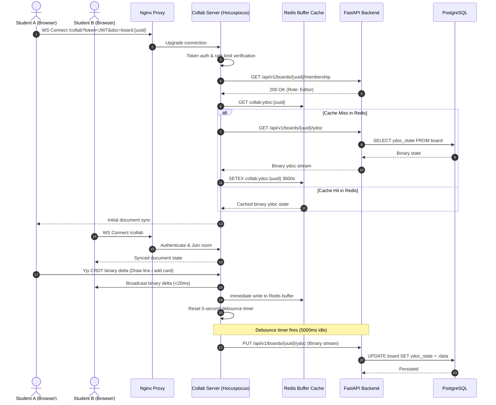
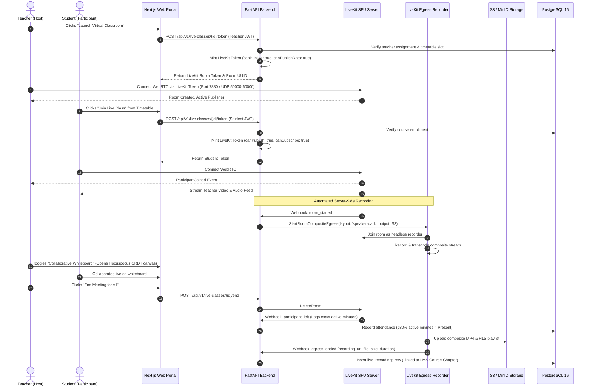

# System Architecture: Real-Time Collaboration & CRDT Architecture

**Document Reference:** CSG-ARCH-005  
**Target Audience:** Frontend Engineers, Realtime Backend Engineers  
**Classification:** Technical Architecture Specification  
**Status:** Canonical Implementation Baseline (LearnHouse Hocuspocus + Yjs)  

---

## 1. Technical Premise: Conflict-Free Replicated Data Types (CRDTs)

Collaborative learning tools—such as interactive classroom whiteboards (`BOARD`), simultaneous document editing, and multi-user diagramming—cannot rely on traditional HTTP REST requests or optimistic database locking. Network latencies and simultaneous edits cause race conditions, lost data, and jarring UI overwrites.

CSG-LMS inherits the high-performance real-time collaboration engine from **LearnHouse** (`apps/collab`), utilizing the **Hocuspocus WebSocket server** and **Yjs CRDTs (Conflict-Free Replicated Data Types)** with Redis caching and debounced PostgreSQL persistence.

---

## 2. Real-Time Collaboration Sequence & Architecture



---

## 3. Key Technical Specifications

### 3.1 Binary Yjs State Compression
- The collaborative canvas state is maintained in-memory as an optimized Yjs binary document (`Uint8Array`).
- Diffs transmitted over WebSockets are pure binary update vectors (typically <1 KB per mutation), achieving sub-20ms broadcast latencies even across mobile 4G networks.

### 3.2 Debounced Database Persistence
- High-frequency drawing events (e.g., freehand pen strokes generating 60 events/second) never hit the PostgreSQL database directly.
- The Hocuspocus daemon buffers updates in Redis and applies a **5-second sliding debounce timer**. Once whiteboard drawing activity pauses for 5 seconds, the accumulated binary state is flushed via `PUT /api/v1/boards/{uuid}/ydoc` to the `board.ydoc_state` column.

### 3.3 Ephemeral Awareness (Presence & Cursors)
- User mouse cursor coordinates, selection bounding boxes, and typing indicators are handled via Yjs Ephemeral Awareness states.
- Awareness states are broadcast directly across active WebSocket clients and are intentionally never persisted to database disk, minimizing storage overhead.

---

## 4. Real-Time Interactive Live Classes & WebRTC Media Architecture

### 4.1 The Need for a Dedicated WebRTC Media Server (LiveKit SFU)
While Hocuspocus and WebSockets excel at synchronized CRDT text and vector whiteboard state, real-time video and audio streaming requires raw UDP packet routing, real-time bandwidth probing, congestion control, and video simulcasting.

Running live video through FastAPI would saturate Python's ASGI event loop, while Hocuspocus lacks WebRTC media protocol stacks (RTP/RTCP, SRTP, ICE/STUN/TURN).

CSG-LMS integrates a dedicated **LiveKit WebRTC SFU (Selective Forwarding Unit)** daemon running alongside FastAPI and Hocuspocus:

| Real-Time Capability | Responsible Engine | Technology Stack | Core Operational Role |
|---|---|---|---|
| **Live Video & Audio SFU** | `LiveKit Server` | Go / WebRTC / Pion | Receives webcam, mic, and screen-sharing streams; forwards to subscribers via adaptive simulcast. |
| **Session Authorization & Tokens** | `FastAPI Backend` | Python / SQLModel | Validates timetable slots, checks student enrollment, and mints cryptographically signed LiveKit JWTs. |
| **Interactive Classroom Whiteboard** | `Hocuspocus Server`| Bun / Yjs CRDT | Manages the collaborative whiteboard canvas modal within the live classroom. |
| **Automated Server Recording** | `LiveKit Egress` | Headless Chrome / FFmpeg | Joins session silently, renders composite grid, transcodes to HLS/MP4, and uploads to S3/MinIO. |

### 4.2 End-to-End Live Class Operational Sequence



---

## 5. Classroom UI Architecture & Automated Composite Archival

### 5.1 Video-First Layout with Collapsible Sidebars
The live classroom adopts an institutional video-first layout (similar to Zoom / Google Meet):

```
┌────────────────────────────────────────────────────────────────────────────────────────┐
│ [CSG-LMS] Grade 10 Biology · Period 3: Cell Mitosis          [Rec ● 00:42:15] [Leave] │
├────────────────────────────────────────────────────────────┬───────────────────────────┤
│                                                            │ 🗪 CHAT & Q&A | 📊 POLLS  │
│  ┌──────────────────────────┐  ┌────────────────────────┐  ├───────────────────────────┤
│  │                          │  │                        │  │ [Q&A Thread]              │
│  │     TEACHER VIDEO        │  │     STUDENT VIDEO 1    │  │ Michael: "Is ATP consumed │
│  │   (Active Speaker)       │  │                        │  │ during anaphase?"         │
│  │                          │  │                        │  │                           │
│  │  ┌──────────────────────────┐  ┌────────────────────────┐  │ [Active Live Poll]        │
│  │  │     STUDENT VIDEO 2      │  │     STUDENT VIDEO 3    │  │ "Identify the phase:"     │
│  │  └──────────────────────────  └────────────────────────┘  │ (•) Metaphase  [68%]      │
│  │                                                            │                           │
│  │                                                            │ [Open Whiteboard Modal]   │
│  │                                                            │ ↳ Launches Hocuspocus CRDT│
│  ├────────────────────────────────────────────────────────────┴───────────────────────────┤
│  │  [🎤 Mute] [📹 Camera] [🖥️ Share Screen] [✋ Raise Hand] [🎨 Whiteboard] [👥 26 Students]│
│  └────────────────────────────────────────────────────────────────────────────────────────┘
```

### 5.2 Automatic Attendance & Asynchronous Course Archive
1. **Zero-Friction Attendance:** WebRTC join/leave timestamps determine active instructional time. Students with $\ge 80\%$ duration are marked Present automatically in the day's attendance register.
2. **Automated LMS Archival:** Within 10 minutes of class conclusion, the LiveKit Egress recorder uploads the finalized composite MP4 and HLS stream to S3/MinIO and links the recording to the corresponding Course Chapter in the student LMS portal for asynchronous revision.
