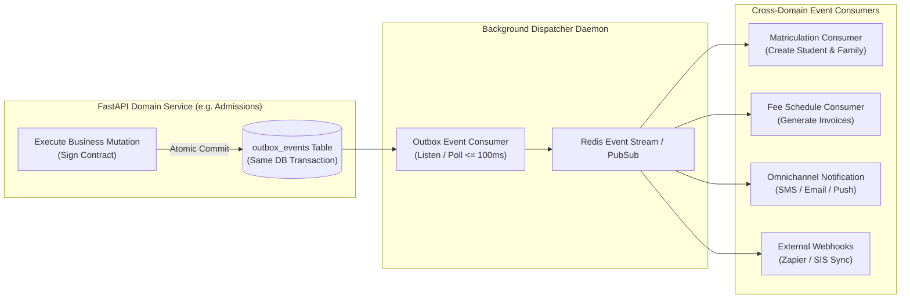

# System Architecture: Event-Driven Integration & Handshake Bus

**Document Reference:** CSG-ARCH-006  
**Target Audience:** Distributed Systems Engineers, Integration Architects  
**Classification:** Technical Architecture Specification  
**Status:** Canonical Implementation Baseline  

---

## 1. Technical Premise: Transactional Outbox Pattern

In an educational monolith spanning Admissions, Academic Operations, and Financial Billing, business workflows must trigger cross-domain handshakes (e.g., *Admissions Contract Signed $\to$ Create Student Master $\to$ Enroll in Batch $\to$ Generate Fee Schedule*). 

Executing these cross-domain mutations in a single, massive database transaction risks distributed deadlocks, long transaction lock times, and partial failures. Conversely, calling external services asynchronously without guaranteed delivery risks state drift.

CSG-LMS implements an **Event-Driven Integration Bus** utilizing the **Transactional Outbox Pattern** on PostgreSQL with Redis stream dispatching and external webhook delivery.

---

## 2. Event-Driven Handshake Topology



---

## 3. The `outbox_events` Schema & Mechanics

```python
class OutboxEvent(MultiTenantBase, table=True):
    __tablename__ = "outbox_events"
    
    id: Optional[int] = Field(default=None, primary_key=True)
    event_uuid: str = Field(unique=True, index=True)
    event_type: str = Field(index=True)  # e.g., "admissions.contract_signed"
    aggregate_type: str = Field(index=True)  # e.g., "admissions_offer"
    aggregate_id: str = Field(index=True)
    payload: Dict[str, Any] = Field(default_factory=dict, sa_column=Column(JSON))
    dispatched_at: Optional[datetime] = None
    retry_count: int = Field(default=0)
    error_message: Optional[str] = None
```

### 3.1 At-Least-Once Delivery Guarantee
1. When a business mutation occurs (e.g., `admissions_offer.status = 'signed'`), an `OutboxEvent` record is inserted **within the exact same database transaction**.
2. If the transaction fails, both the mutation and the outbox event roll back together, guaranteeing absolute zero ghost events.
3. The background dispatcher processes pending outbox rows, publishes them to the Redis stream, and marks `dispatched_at = NOW()`.
4. Idempotency keys on consumers prevent duplicate processing of re-delivered events.

---

## 4. Key Cross-Domain Event Handshakes

| Event Type | Emitting Domain | Consuming Services & Handshake Action |
|---|---|---|
| `admissions.contract_signed` | Domain 3 (Admissions) | • Academic Core: Triggers automated student matriculation and roll number generation.<br>• Finance: Generates term fee schedules and initial invoice.<br>• IT: Provisions student SSO and parent portal accounts. |
| `academics.student_matriculated` | Domain 1 (Academic Core) | • Batches: Assigns student to designated cohort section.<br>• Health: Flags medical allergies to school clinic. |
| `academics.term_closed` | Domain 1 (Academic Core) | • Evaluation: Locks teacher gradebooks against further edits.<br>• Gradebook: Triggers automated final report card generation. |
| `attendance.truancy_alert` | Domain 1 (Attendance) | • Student Care: Dispatches high-priority early-warning alert to guidance counselor.<br>• Notification: Sends SMS notification to primary guardian. |
| `assessment.exam_anomaly` | Domain 2 (Assessment) | • Evaluation: Logs proctoring irregularity flag on student exam submission. |

---

## 5. Asynchronous Distributed Worker Pool (`ARQ` + Redis)

### 5.1 Worker Architecture & Multi-Queue Taxonomy
Compute-intensive operations (5D Timetable NP-hard solving, bulk gradecard rendering, curriculum RAG indexing) cannot run synchronously within FastAPI request threads.

CSG-LMS implements **ARQ** (asyncio-native Redis task queue worker), operating across four isolated priority queues:

| Queue Name | Concurrency Limit | Job Types Executed | Typical SLA |
|---|---|---|---|
| `high_priority` | 10 Concurrent | Single-parent SMS/WhatsApp emergency alerts, MFA codes, entrance exam scoring. | $< 2$ seconds |
| `default` | 8 Concurrent | Course batch enrollments, assignment auto-grading, promotion ledger staging, timetable manual conflict checks. | $< 10$ seconds |
| `pdf_reports` | 4 Concurrent | Gotenberg bulk PDF generation (term report cards, tabulation sheets, fee challan PDFs). | $< 60$ seconds |
| `ai_indexing` | 2 Concurrent | Curriculum RAG textbook chunking, vector embedding generation via OpenAI/Ollama. | Background |

### 5.2 Asynchronous Job Dispatch Pattern

```python
# apps/api/src/services/task_dispatcher.py
from arq import create_pool
from arq.connections import RedisSettings
import os

class TaskDispatcher:
    def __init__(self):
        self.redis_settings = RedisSettings.from_dsn(os.getenv("REDIS_URL", "redis://localhost:6379/0"))
        self._pool = None

    async def get_pool(self):
        if not self._pool:
            self._pool = await create_pool(self.redis_settings)
        return self._pool

    async def enqueue(self, task_name: str, queue_name: str = "default", **kwargs) -> str:
        pool = await self.get_pool()
        job = await pool.enqueue_job(task_name, _queue_name=queue_name, **kwargs)
        return job.job_id
```

---

## 6. Scheduled Cron Daemon Architecture (`ARQ Cron`)

The `arq-cron` process executes recurring time-based institutional reconciliations:

```
┌────────────────────────────────────────────────────────────────────────────────────────┐
│                              RECURRING INSTITUTIONAL CRON JOBS                         │
├───────────────────┬────────────────────┬───────────────────────────────────────────────┤
│ Schedule          │ Job Function       │ Operational Purpose                           │
├───────────────────┼────────────────────┼───────────────────────────────────────────────┤
│ Daily @ 00:05 UTC │ `run_truancy_audit`│ Evaluates period attendance logs. Flags       │
│                   │                    │ students with ≥3 unexcused absences.          │
├───────────────────┼────────────────────┼───────────────────────────────────────────────┤
│ Daily @ 01:00 UTC │ `reconcile_fees`   │ Evaluates unpaid fee schedules. Transitions   │
│                   │                    │ past-due invoices into 30/60/90-day aging.    │
├───────────────────┼────────────────────┼───────────────────────────────────────────────┤
│ Daily @ 02:00 UTC │ `auto_lock_grades` │ Locks gradebook columns for past-due terms to │
│                   │                    │ prevent retroactive grade manipulation.       │
├───────────────────┼────────────────────┼───────────────────────────────────────────────┤
│ Every 15 Minutes  │ `flush_outbox`     │ Outbox Sweeper: Re-dispatches failed outbox   │
│                   │                    │ events with exponential backoff.              │
└───────────────────┴────────────────────┴───────────────────────────────────────────────┘
```

---

## 7. Gotenberg High-Fidelity Document & PDF Engine

Official stamped documents (Term Report Cards, Official Transcripts, Bank Fee Challans, Student ID Badges) require exact visual fidelity and strict print pagination.

CSG-LMS integrates a **Gotenberg** (headless Chromium) microservice listening on internal port 3000:
1. **HTML5 + TailwindCSS Print Styling:** Renders modern CSS Grid, Flexbox, custom institutional fonts, and vector SVG charts.
2. **Cryptographic Tamper-Evidence:** Every official transcript and diploma embeds an HMAC-SHA256 signature and a dynamic verification QR code pointing to `https://portal.school.edu/verify/{document_uuid}`.
3. **Non-Blocking Asynchronous Export:** FastAPI enqueues generation tasks to `pdf_reports` $\to$ ARQ worker calls Gotenberg $\to$ Stores PDF in S3/MinIO $\to$ Delivers 24-hour presigned URL to client via WebSocket / email.

---

## 8. Omnichannel Notification Pipeline

Multi-channel dispatch is orchestrated through ARQ background workers with token-bucket rate limiters:
- **WhatsApp Cloud API:** 80 msg/sec limit per WABA number; automated fallback to SMS if template is rejected.
- **Firebase Cloud Messaging (FCM):** Multicast batch dispatch (500 tokens per call) for mobile and web push.
- **Twilio / Telnyx SMS:** Urgent truancy and emergency campus alerts.
- **AWS SES / Postmark Email:** High-deliverability transactional emails with attached Gotenberg PDF gradecards.

---

## 9. Deliberate Architectural Exclusions & Technology Pruning Matrix

| Technology | Architectural Verdict | Technical Justification |
|---|---|---|
| **IoT / Hardware Telemetry Gateway** | **DEFERRED (Phase 2)** | Physical biometric turnstiles and bus GPS telemetry require on-premise hardware integrations. For Phase 1, staff record attendance via mobile 1-click roll call, and transportation operates on scheduled timetable matrices. |
| **Apache Kafka** | **EXCLUDED** | Heavy multi-gigabyte JVM footprint and cluster complexity. **Redis 7.2 Streams** + PostgreSQL Transactional Outbox handle 50,000 events/second at near-zero overhead. |
| **Elasticsearch / Meilisearch** | **EXCLUDED** | Avoids data synchronization drift. PostgreSQL 16's native `tsvector` (GIN lexical search) + `pgvector` (HNSW semantic search) provides unified hybrid search natively. |
| **External Video Transcoding SaaS** | **EXCLUDED** | Live classrooms are recorded directly by **LiveKit Egress**. Course video uploads are transcoded asynchronously via an ARQ worker FFmpeg task. |
