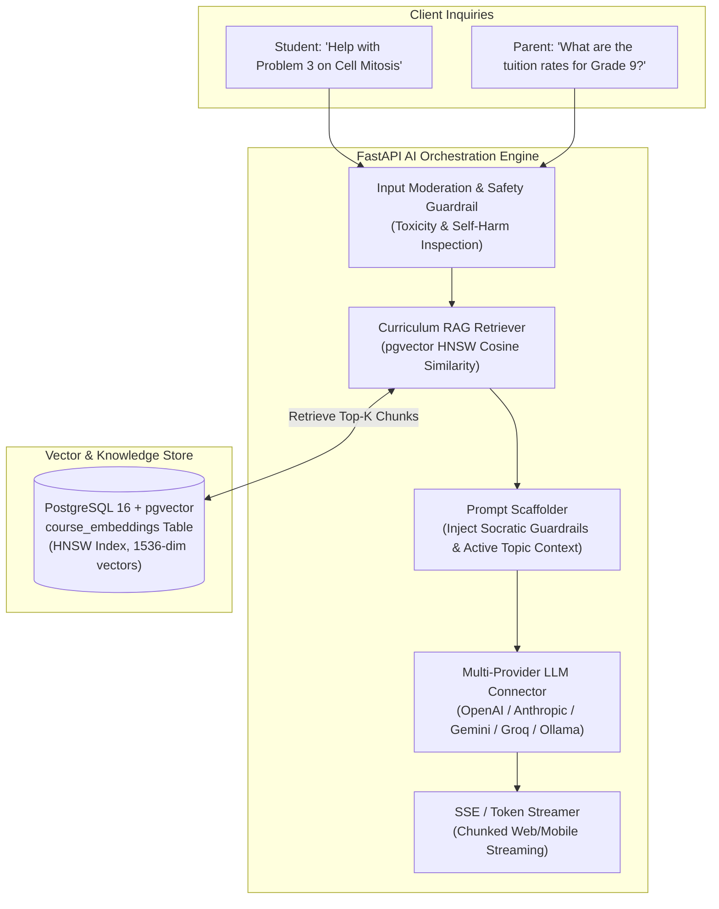

# System Architecture: Embedded AI Engine & Curriculum RAG

**Document Reference:** CSG-ARCH-007  
**Target Audience:** AI Engineers, Machine Learning Engineers, Backend Architects  
**Classification:** Technical Architecture Specification  
**Status:** Canonical Implementation Baseline (LearnHouse AI Service Revamped)  

---

## 1. Technical Premise: Multi-Provider LLM Orchestration & RAG

To prevent vendor lock-in and optimize operational inference costs, CSG-LMS inherits the **LearnHouse AI Architecture** (`apps/api/src/services/ai_service.py`), supporting dynamic multi-provider model routing across OpenAI, Anthropic, Google Gemini, Groq, and local Ollama deployments.

Furthermore, to guarantee that the AI Socratic Tutor never hallucinates and remains strictly grounded in the school's approved curriculum, the system implements **Retrieval-Augmented Generation (RAG)** directly inside PostgreSQL utilizing the `pgvector` extension.

---

## 2. Embedded AI Technical Architecture



---

## 3. Curriculum Vector Embeddings (`course_embeddings`)

```python
from sqlmodel import SQLModel, Field
from pgvector.sqlalchemy import Vector
from sqlalchemy import Column
from typing import Optional

class CourseEmbedding(MultiTenantBase, table=True):
    __tablename__ = "course_embeddings"
    
    id: Optional[int] = Field(default=None, primary_key=True)
    course_id: int = Field(foreign_key="courses.id", index=True)
    chapter_id: Optional[int] = Field(foreign_key="chapters.id", index=True)
    topic_id: Optional[int] = Field(foreign_key="syllabus_topics.id", index=True)
    
    chunk_content: str
    chunk_metadata: Dict[str, Any] = Field(default_factory=dict, sa_column=Column(JSON))
    
    # 1536-dimensional embedding vector (OpenAI text-embedding-3-small or Gemini)
    embedding: Any = Field(sa_column=Column(Vector(1536)))
```

### 3.1 RAG Semantic Retrieval Pipeline
1. When an enrolled student submits an inquiry, the system identifies the student's active enrolled course and current syllabus topic.
2. The query text is vectorized and matched against `course_embeddings` scoped to `CourseEmbedding.course_id == active_course_id`.
3. The SQL query executes using HNSW cosine distance:
   ```sql
   SELECT chunk_content, 1 - (embedding <=> :query_vector) AS similarity
   FROM course_embeddings
   WHERE org_id = :org_id AND course_id = :course_id
   ORDER BY embedding <=> :query_vector
   LIMIT 3;
   ```
4. Only chunks exceeding a strict cosine similarity threshold ($\ge 0.82$) are passed to the system prompt. If no matching curriculum content is found, the AI politely informs the student to consult their teacher directly.

---

## 4. Multi-Provider Fallback & FinOps Routing
- **Latency & Cost Optimization:**
  - *Tier 1 (High-Speed / Low-Cost):* Simple admissions FAQs and quiz generation route to ultra-fast inference engines (e.g., Groq Llama 3 or Gemini Flash).
  - *Tier 2 (High-Reasoning):* Complex Socratic mathematics tutoring and essay rubric evaluations route to advanced frontier models (e.g., Claude 3.5 Sonnet or GPT-4o).
- **Graceful Failover:** If a primary cloud API experiences a transient outage or rate limit (HTTP 429/500), the connector instantly fails over to the backup provider within 200ms without dropping the user session.
