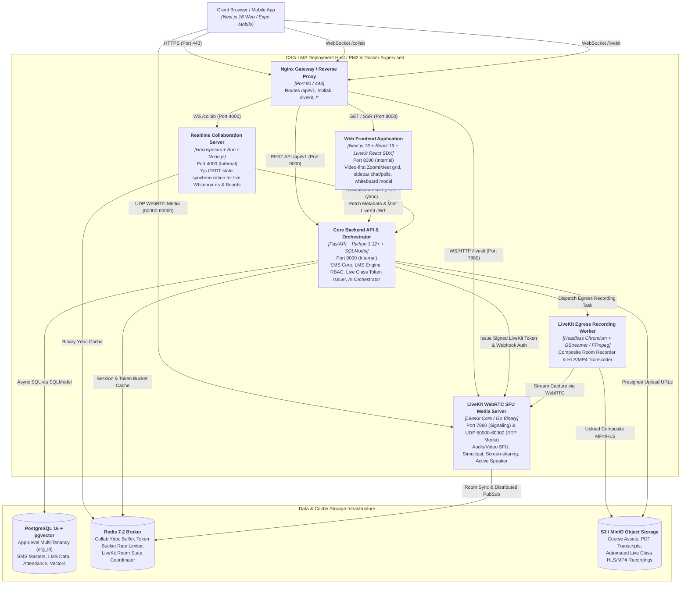
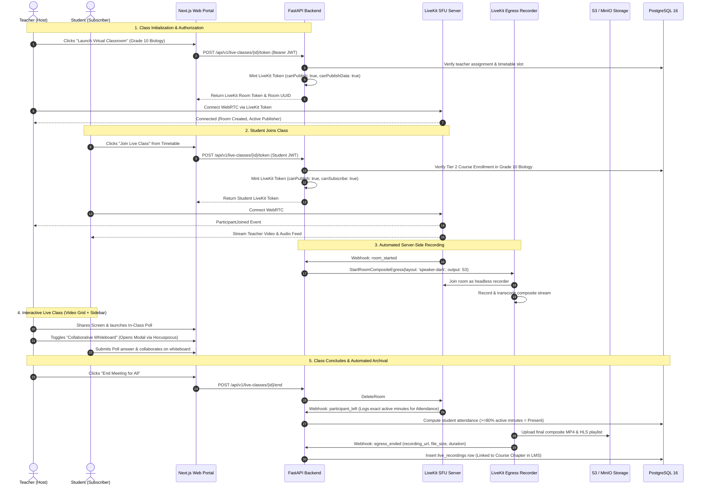

# System Architecture: Expanded LearnHouse Architecture & Live Classes Service Integration

**Document Reference:** CSG-ARCH-009  
**Target Audience:** Chief Technology Officer, System Architects, DevOps Leads, Full-Stack Engineers  
**Classification:** Technical Architecture Specification (Expanded Target Architecture)  
**Status:** Canonical Implementation Baseline  

---

## 1. Architectural Diagnosis: The Need for a Dedicated Media Service

### 1.1 Is a New Service Required for Live Classes?
> [!IMPORTANT]
> **Architectural Verdict: Yes, absolutely.** 
> You are 100% correct in your assessment. Adding real-time interactive live classes cannot be handled by simply adding endpoints to FastAPI or streaming media through Hocuspocus. It requires a dedicated, specialized WebRTC media service.

### 1.2 Why FastAPI and Hocuspocus Cannot Handle Live Video
1. **FastAPI (HTTP / Async Python):**
   - FastAPI is optimized for JSON APIs, database transactions, background worker tasks, and AI LLM prompt assembly.
   - Live video and audio streaming requires raw UDP packet routing, real-time bandwidth probing, congestion control, and video simulcasting. Handling dozens of simultaneous video streams in Python would saturate CPU workers and degrade API responsiveness for the entire school.
2. **Hocuspocus (WebSockets / Bun / Node.js):**
   - Hocuspocus is specifically engineered for **Yjs CRDT text and visual state synchronization** (whiteboard drawing strokes, cursor coordinates, collaborative text editing).
   - Video/audio media frames require WebRTC protocols (RTP/RTCP, SRTP, ICE/STUN/TURN, DTLS) and Selective Forwarding Units (SFUs), which are completely out of scope for a CRDT document synchronization daemon.
3. **The Solution: LiveKit WebRTC SFU Server:**
   - To deliver broadcast-quality, low-latency (<150ms) virtual classrooms with 25–50+ simultaneous webcams, screen sharing, and automated composite recording, we introduce a dedicated **LiveKit SFU Service** container running in the architecture alongside FastAPI and Hocuspocus.

---

## 2. The Complete Expanded Target Architecture

Below is the complete C4 Level 2 Container Diagram showing how the LearnHouse architecture will look after the entire system (LMS + SMS + AI + Live Classes + Automated Recording) is fully deployed:



> **Reconciliation note (§2) — ports verified against `dokploy-compose.yml`.** api 9000 ✓
> (`LEARNHOUSE_PORT: 9000`, L74; healthcheck L144), collab 4000 ✓ (`COLLAB_PORT: 4000`,
> L297). LiveKit listens on **7880 inside the network** (`LIVEKIT_INTERNAL_URL=ws://livekit:7880`,
> L123) but is **published to the host as 7883** (`"7883:7880"`, L271). The web frontend is
> **not** on 8000 — the `web` service runs `PORT: 3000` (L355). Next.js 16 + React 19
> confirmed: `apps/web/package.json:116` → `"next": "^16.2.9"`, `:123` → `"react": "19.2.8"`.
> Ingress is Traefik via Dokploy, not the nginx gateway drawn above.

---

## 3. Component Deep Dive: Live Classes Service Integration

### 3.1 Division of Labor Across the Three Core Daemons

| Capability | Responsible Daemon | Underlying Technology | Operational Role |
|---|---|---|---|
| **Live Video & Audio SFU** | `LiveKit Server` | Go / WebRTC / Pion | Receives camera/audio/screen streams from participants; selectively forwards streams to subscribers using adaptive bitrate simulcast. |
| **Classroom Orchestration & Security** | `FastAPI Backend` | Python / SQLModel | Validates teacher schedule against timetable slots; verifies student enrollments; mints cryptographically signed LiveKit JWT tokens with publisher vs subscriber permissions; receives webhooks (`room_started`, `participant_joined`, `egress_ended`). |
| **Interactive Whiteboard in Class** | `Hocuspocus Server` | Bun / Yjs CRDT | When the teacher opens the shared whiteboard modal during a live class, Hocuspocus manages the multi-cursor visual whiteboard canvas in sync. |
| **Automated Composite Recording** | `LiveKit Egress` | GStreamer / FFmpeg | Joins the live session as an invisible recorder, captures the video grid + shared screen + audio, transcodes to HLS/MP4, and uploads to S3/MinIO. |

> **Reconciliation note (§3.1) — "verifies student enrollments" was NOT met when this was written; it is now closed.**
> At the time of writing `POST /live/rooms/{room_name}/token` was gated by authentication
> only, so any authenticated user at any school could mint a token for any room. It has since
> been fixed in `apps/api/src/routers/live_classes.py`: the token handler (L308) calls
> `_assert_may_enter_room` (L265), which requires host status (`_caller_is_host`, L153) **or**
> an active `StudentEnrollment` in the session's section (`_caller_is_enrolled`, L237,
> `status == "active"`), and enforces org/campus scope via `_assert_session_in_scope` (L218).
> Non-members get 404, never 403.
>
> **Reconciliation note (§3.1) — LiveKit Egress is still not deployed.** No egress service
> exists in any compose file, so the "Automated Composite Recording" row above is
> aspirational: `apps/api/src/db/sms_live_class.py` models the recording lifecycle
> (`RecordingStatus`, `egress_id`, `recording_object_key`) but nothing writes it. Outstanding
> — Phase 3 of `PROJECT_DOCS/RECONCILIATION_PLAN.md`.

---

## 4. End-to-End Live Class Operational Flow



> **Reconciliation note (§4, step 5) — the ≥80% attendance computation is not implemented.**
> `LiveClassAttendanceLog.duration_minutes` is recorded
> (`apps/api/src/db/sms_live_class.py:114`), but there is no percentage computation, no
> ≥80% threshold, and no bridge writing into `StudentAttendance` — `StudentAttendance` is not
> referenced anywhere in the live-class routers or services. Outstanding — Phase 3 of
> `PROJECT_DOCS/RECONCILIATION_PLAN.md`.

---

## 5. Classroom UI Architecture: Video-First Grid with Sidebar

In accordance with institutional best practices, the live classroom adopts a **Video-First Layout with Collapsible Sidebars** (similar to Zoom / Google Meet):

```
┌────────────────────────────────────────────────────────────────────────────────────────┐
│ [CSG-LMS] Grade 10 Biology · Period 3: Cell Mitosis          [Rec ● 00:42:15] [Leave] │
├────────────────────────────────────────────────────────────┬───────────────────────────┤
│                                                            │ 🗪 CHAT & Q&A | 📊 POLLS  │
│  ┌──────────────────────────┐  ┌────────────────────────┐  ├───────────────────────────┤
│  │                          │  │                        │  │ [Q&A Thread]              │
│  │                          │  │                        │  │ Michael: "Is ATP consumed │
│  │     TEACHER VIDEO        │  │     STUDENT VIDEO 1    │  │ during anaphase?"         │
│  │   (Active Speaker)       │  │                        │  │ 👍 4 Upvotes              │
│  │                          │  │                        │  │                           │
│  └──────────────────────────┘  └────────────────────────┘  │ [Active Live Poll]        │
│  ┌──────────────────────────┐  ┌────────────────────────┐  │ "Identify the phase:"     │
│  │                          │  │                        │  │ (•) Metaphase  [68%]      │
│  │                          │  │                        │  │ ( ) Telophase  [32%]      │
│  │     STUDENT VIDEO 2      │  │     STUDENT VIDEO 3    │  │                           │
│  │                          │  │                        │  │ [Open Whiteboard Modal]   │
│  └──────────────────────────┘  └────────────────────────┘  │ ↳ Launches Hocuspocus CRDT│
├────────────────────────────────────────────────────────────┴───────────────────────────┤
│  [🎤 Mute] [📹 Camera] [🖥️ Share Screen] [✋ Raise Hand] [🎨 Whiteboard] [👥 26 Students]│
└────────────────────────────────────────────────────────────────────────────────────────┘
```

---

## 6. Live Classes Database Schema Integration (`SQLModel`)

The live classes engine integrates cleanly into our existing `SQLModel` database schema under `packages/database` or `apps/api/src/db/live_classes.py`:

```python
from sqlmodel import SQLModel, Field
from typing import Optional
from datetime import datetime

class LiveClass(MultiTenantBase, table=True):
    __tablename__ = "live_classes"
    
    id: Optional[int] = Field(default=None, primary_key=True)
    room_uuid: str = Field(unique=True, index=True)
    course_id: int = Field(foreign_key="courses.id", index=True)
    batch_id: int = Field(foreign_key="student_batches.id", index=True)
    instructor_id: int = Field(foreign_key="instructors.id", index=True)
    schedule_slot_id: Optional[int] = Field(foreign_key="course_schedules.id", index=True)
    
    title: str = Field(index=True)  # e.g., "Biology Period 3: Cell Mitosis"
    scheduled_start: datetime = Field(index=True)
    scheduled_end: datetime
    actual_start: Optional[datetime] = None
    actual_end: Optional[datetime] = None
    status: str = Field(default="scheduled")  # scheduled, live, ended, cancelled
    is_recording_enabled: bool = Field(default=True)

class LiveAttendanceLog(MultiTenantBase, table=True):
    __tablename__ = "live_attendance_logs"
    
    id: Optional[int] = Field(default=None, primary_key=True)
    live_class_id: int = Field(foreign_key="live_classes.id", index=True)
    user_id: int = Field(foreign_key="user.id", index=True)
    student_id: Optional[int] = Field(foreign_key="students.id", index=True)
    
    join_time: datetime
    leave_time: Optional[datetime] = None
    active_seconds: int = Field(default=0)
    attended_percentage: float = Field(default=0.0)

class LiveRecording(MultiTenantBase, table=True):
    __tablename__ = "live_recordings"
    
    id: Optional[int] = Field(default=None, primary_key=True)
    live_class_id: int = Field(foreign_key="live_classes.id", unique=True, index=True)
    course_id: int = Field(foreign_key="courses.id", index=True)
    chapter_id: Optional[int] = Field(foreign_key="chapters.id", index=True)
    
    recording_url: str  # S3 URL / HLS Playlist URL
    duration_seconds: int = Field(default=0)
    file_size_bytes: int = Field(default=0)
    transcoding_status: str = Field(default="ready")  # recording, transcoding, ready, failed
```

> **Reconciliation note (§6) — these models are a proposal, not the shipped schema.** The
> live-class tables that actually exist are in `apps/api/src/db/sms_live_class.py`:
> `sms_live_class_session` (L23) ← `live_classes`; `sms_live_class_attendance` (L84) ←
> `live_attendance_logs`; `sms_live_class_detail` (L176) ← `live_recordings` (it carries
> `recording_status`, `egress_id`, `recording_object_key`, `recording_duration_seconds`);
> `sms_live_class_coursework` (L258) ← the recording→LMS-chapter link. **Do not rename** —
> the recorded decision in `PROJECT_DOCS/RECONCILIATION_PLAN.md` is that code wins.
>
> **Reconciliation note (§6) — `MultiTenantBase` does not exist.** There is no such base
> class anywhere in `apps/api/src/`. This codebase uses explicit `org_id` / `campus_id`
> columns per model; introducing a base class would make live classes the only table using
> one. Drop it.
>
> **Reconciliation note (§6) — none of the four FK target tables exist.** `student_batches`,
> `instructors`, `students` and `course_schedules` are not tables in this schema. Map them to
> the real entities: `class_section` (`apps/api/src/db/sms_campus.py:210`), `user` +
> `StaffProfile` for the instructor, `StudentEnrollment` (`sms_campus.py:300`) for roster
> membership, and `sms_timetable_schedule` (`apps/api/src/db/sms_timetable.py:69`) for the slot.

---

## 7. Deployment & Process Topology Update

The Docker / PM2 deployment topology (`ecosystem.config.js`) seamlessly incorporates the LiveKit media daemon:

```
┌────────────────────────────────────────────────────────────────────────────────────────┐
│                        SUPERVISED PM2 PROCESSES (ALL-IN-ONE CONTAINER)                 │
├───────────────────┬───────────────────┬───────────────────┬────────────────────────────┤
│ 1. nginx-gateway  │ 2. web-frontend   │ 3. api-backend    │ 4. collab-server           │
│ • Reverse proxy   │ • Next.js 16 SSR  │ • FastAPI Python  │ • Hocuspocus Bun           │
│ • Ports 80 / 443  │ • Port 8000       │ • Port 9000       │ • Port 4000                │
├───────────────────┴───────────────────┴───────────────────┴────────────────────────────┤
│ 5. livekit-server (WebRTC SFU Daemon)                                                  │
│ • LiveKit Go binary running locally inside container or dedicated sidecar             │
│ • Port 7880 (Signaling / HTTP) & UDP Ports 50000–60000 (RTP Video/Audio Media)         │
├────────────────────────────────────────────────────────────────────────────────────────┤
│ 6. livekit-egress (Background Recording Daemon)                                        │
│ • GStreamer / FFmpeg composite headless recorder archiving to S3/MinIO                  │
└────────────────────────────────────────────────────────────────────────────────────────┘
```

> **Reconciliation note (§7) — current process topology differs.** An `arq` worker has been
> added (`docker/start.sh:28`, `dokploy-compose.yml:165`, `docker-compose.prod.yml:208-211`),
> so the supervised set is now web / api / **worker** / collab. **LiveKit and Egress are
> still not PM2-managed:** `docker/start.sh` starts only `learnhouse-web`, `learnhouse-api`,
> `learnhouse-worker` and `learnhouse-collab`. LiveKit runs as its own compose service
> (`dokploy-compose.yml:264`) and Egress does not exist at all. See
> `PROJECT_DOCS/RECONCILIATION_PLAN.md`.

---

## 8. Summary of Architectural Advantages
1. **Zero Python Event Loop Blockage:** High-bandwidth WebRTC video routing is offloaded entirely to compiled Go/C++ SFU engines, keeping FastAPI light and responsive.
2. **Reuses Hocuspocus Elegantly:** Hocuspocus is not duplicated or reinvented; it acts as the collaborative whiteboard canvas inside the video meeting.
3. **Automated Zero-Friction Attendance:** WebRTC join/leave telemetry feeds directly into the daily school attendance register without requiring the teacher to manually record who attended.

> **Reconciliation note (§8, advantage 3) — not yet delivered.** See the §4 note: join/leave
> duration is logged, but no percentage, no ≥80% rule and no write into `StudentAttendance`
> exist. Outstanding — Phase 3 of `PROJECT_DOCS/RECONCILIATION_PLAN.md`.
4. **Instant Course Library Archival:** Recorded lessons become asynchronous video content blocks in the student's LMS course timeline within 10 minutes of class conclusion.
