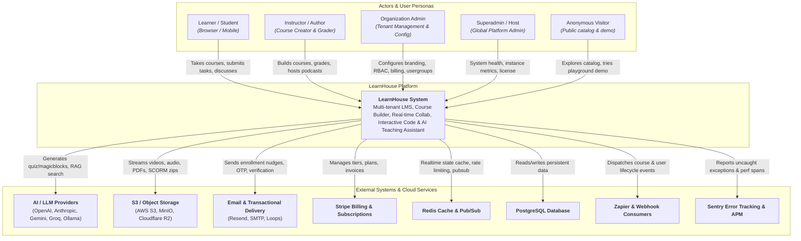
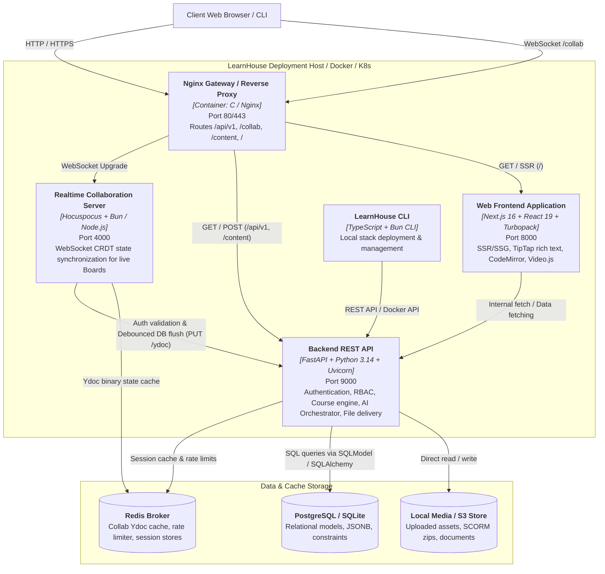
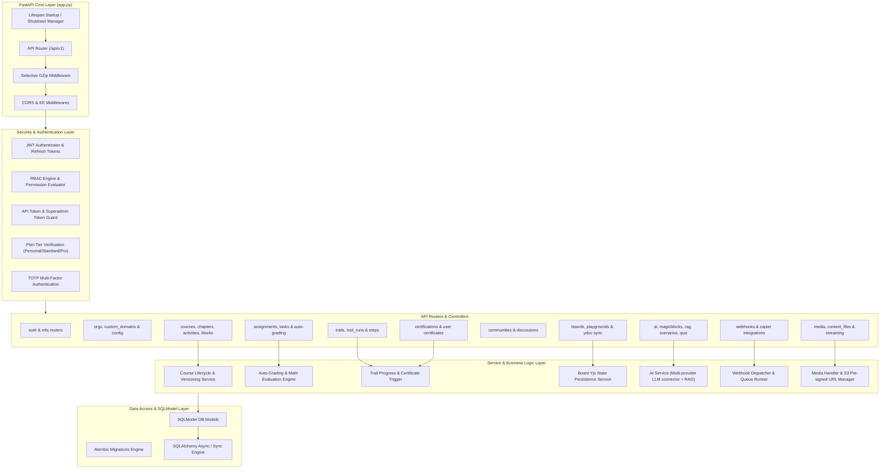
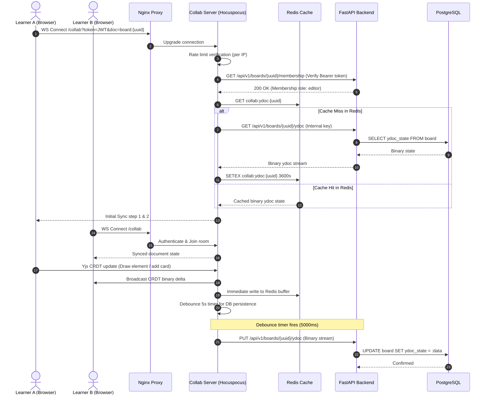
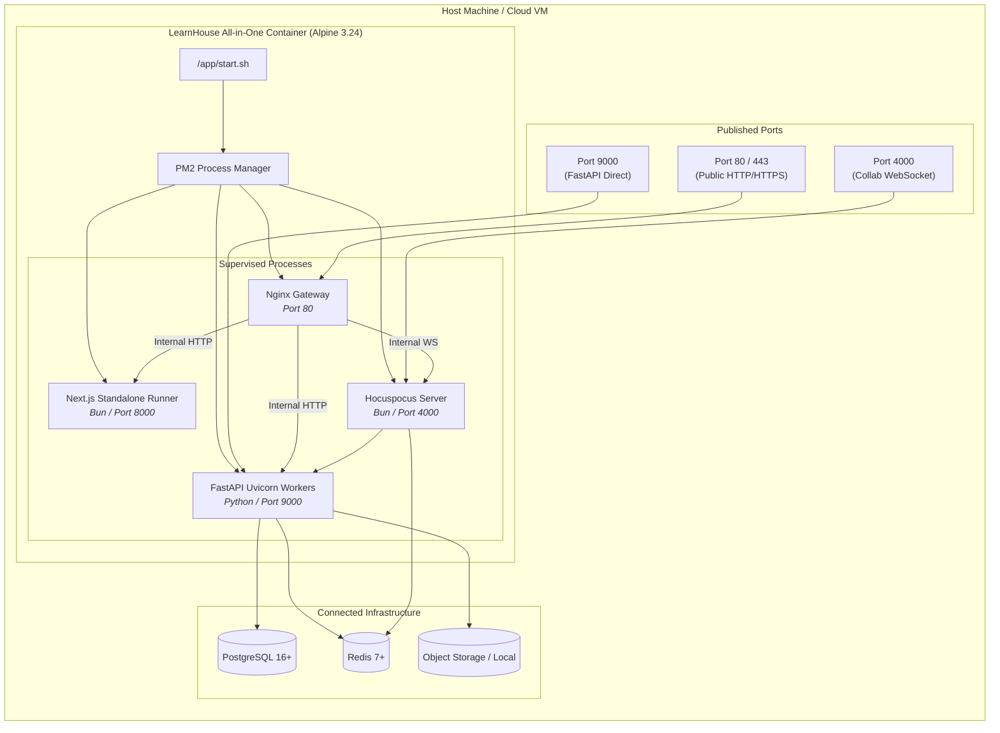

# LearnHouse · System Architecture & Entity-Relationship Documentation

This document contains the complete **Entity-Relationship Diagram (ERD)**, **C4 Multi-Level Architecture Models**, and **System Workflow Details** for the LearnHouse platform.

---

## 1. Entity-Relationship Diagram (ERD)

The diagram below captures the complete database schema implemented across SQLModel / SQLAlchemy models in `apps/api/src/db/`:

```mermaid
erDiagram
    %% ============================================================
    %% 1. IDENTITY & MULTI-TENANCY
    %% ============================================================
    ORGANIZATION ||--o{ USER_ORGANIZATION : "members"
    USER ||--o{ USER_ORGANIZATION : "memberships"
    ROLE ||--o{ USER_ORGANIZATION : "assigned_to"
    ORGANIZATION ||--o{ ROLE : "defines"
    ORGANIZATION ||--o| ORGANIZATION_CONFIG : "configured_by"
    ORGANIZATION ||--o{ USERGROUP : "owns"
    USERGROUP ||--o{ USERGROUP_USER : "has_members"
    USER ||--o{ USERGROUP_USER : "belongs_to"
    USERGROUP ||--o{ USERGROUP_RESOURCE : "locks/gates"
    USER ||--o{ USER_MFA : "authenticates_with"
    USER ||--o{ USER_AUDIT_EVENT : "generates"
    ORGANIZATION ||--o{ API_TOKEN : "scoped_to"
    ORGANIZATION ||--o{ WEBHOOK : "triggers"
    ORGANIZATION ||--o{ CUSTOM_DOMAIN : "maps_to"

    ORGANIZATION {
        int id PK
        string org_uuid UK
        string slug UK
        string name
        string email
        boolean explore
        boolean is_demo
        json socials
        json links
        json scripts
    }

    USER {
        int id PK
        string user_uuid UK
        string username
        string email UK
        string password
        boolean is_superadmin
        boolean email_verified
        string signup_method
        json details
        json profile
        jsonb extra_metadata
    }

    ROLE {
        int id PK
        int org_id FK
        string role_uuid
        string role_type
        string name
        json rights "Granular CRUD + Own flags"
    }

    USER_ORGANIZATION {
        int id PK
        int user_id FK
        int org_id FK
        int role_id FK
    }

    USERGROUP {
        int id PK
        int org_id FK
        string usergroup_uuid
        string name
        string description
    }

    USERGROUP_RESOURCE {
        int id PK
        int usergroup_id FK
        int org_id FK
        string resource_uuid
    }

    %% ============================================================
    %% 2. COURSE STRUCTURE & LEARNING OBJECTS
    %% ============================================================
    ORGANIZATION ||--o{ COURSE : "hosts"
    COURSE ||--o{ COURSE_CHAPTER : "orders"
    CHAPTER ||--o{ COURSE_CHAPTER : "assigned_to"
    COURSE ||--o{ CHAPTER : "contains"
    CHAPTER ||--o{ ACTIVITY : "contains"
    COURSE ||--o{ ACTIVITY : "contains"
    ACTIVITY ||--o{ BLOCK : "composed_of"
    ACTIVITY ||--o{ ACTIVITY_VERSION : "versioned_as"
    COURSE ||--o{ RESOURCE_AUTHOR : "authored_by"
    USER ||--o{ RESOURCE_AUTHOR : "authors"

    COURSE {
        int id PK
        int org_id FK
        string course_uuid UK
        string name
        string thumbnail_type "image|video|both"
        string thumbnail_image
        string thumbnail_video
        boolean public
        boolean published
        boolean open_to_contributors
        jsonb seo
        jsonb extra_metadata
    }

    CHAPTER {
        int id PK
        int org_id FK
        int course_id FK
        string chapter_uuid UK
        string name
        string lock_type "public|authenticated|restricted"
        jsonb extra_metadata
    }

    ACTIVITY {
        int id PK
        int org_id FK
        int course_id FK
        string activity_uuid UK
        string name
        string activity_type "VIDEO|DOCUMENT|DYNAMIC|ASSIGNMENT|SCORM|CUSTOM"
        string activity_sub_type
        string lock_type "public|authenticated|restricted"
        json content
        json details
        boolean published
        int current_version
        int last_modified_by_id FK
    }

    BLOCK {
        int id PK
        int org_id FK
        int course_id FK
        int chapter_id FK
        int activity_id FK
        string block_uuid
        string block_type "QUIZ|VIDEO|PDF|IMAGE|AUDIO|CUSTOM"
        json content
    }

    %% ============================================================
    %% 3. ASSIGNMENTS, SUBMISSIONS & CERTIFICATIONS
    %% ============================================================
    ACTIVITY ||--o| ASSIGNMENT : "configures"
    ASSIGNMENT ||--o{ ASSIGNMENT_TASK : "consists_of"
    ASSIGNMENT_TASK ||--o{ ASSIGNMENT_TASK_SUBMISSION : "receives"
    USER ||--o{ ASSIGNMENT_TASK_SUBMISSION : "submits"
    ASSIGNMENT ||--o{ ASSIGNMENT_USER_SUBMISSION : "tracks_overall"
    USER ||--o{ ASSIGNMENT_USER_SUBMISSION : "completes"
    COURSE ||--o| CERTIFICATIONS : "awards"
    CERTIFICATIONS ||--o{ CERTIFICATE_USER : "issues"
    USER ||--o{ CERTIFICATE_USER : "earns"

    ASSIGNMENT {
        int id PK
        int org_id FK
        int course_id FK
        int chapter_id FK
        int activity_id FK
        string assignment_uuid UK
        string title
        string grading_type "ALPHABET|NUMERIC|PERCENTAGE|PASS_FAIL|GPA_SCALE"
        boolean auto_grading
        boolean anti_copy_paste
        boolean show_correct_answers
        boolean allow_retries
        int max_retries
        float pass_threshold_percentage
        boolean ungraded
        string solution
        string solution_reveal "NEVER|ON_SUBMISSION|AFTER_GRADING"
        string due_date
    }

    ASSIGNMENT_TASK {
        int id PK
        int assignment_id FK
        string assignment_task_uuid
        string title
        string assignment_type "FILE_SUBMISSION|QUIZ|FORM|CODE|SHORT_ANSWER|NUMBER_ANSWER|CUSTOM"
        json contents
        int max_grade_value
    }

    ASSIGNMENT_TASK_SUBMISSION {
        int id PK
        int user_id FK
        int assignment_task_id FK
        string assignment_task_submission_uuid
        json task_submission
        int grade
        string task_submission_grade_feedback
        boolean manually_graded
    }

    ASSIGNMENT_USER_SUBMISSION {
        int id PK
        int user_id FK
        int assignment_id FK
        string assignmentusersubmission_uuid
        string submission_status "PENDING|SUBMITTED|GRADED|LATE|NOT_SUBMITTED"
        int grade
        int attempt_number
        string overall_feedback
    }

    CERTIFICATIONS {
        int id PK
        int course_id FK
        string certification_uuid UK
        json config
    }

    CERTIFICATE_USER {
        int id PK
        int user_id FK
        int certification_id FK
        string user_certification_uuid UK
    }

    %% ============================================================
    %% 4. PROGRESSION (TRAILS)
    %% ============================================================
    ORGANIZATION ||--o{ TRAIL : "tracks"
    USER ||--o{ TRAIL : "owns"
    TRAIL ||--o{ TRAIL_RUN : "has"
    COURSE ||--o{ TRAIL_RUN : "run_for"
    TRAIL_RUN ||--o{ TRAIL_STEP : "records"
    ACTIVITY ||--o{ TRAIL_STEP : "completed_step"

    TRAIL {
        int id PK
        int org_id FK
        int user_id FK
        string trail_uuid
    }

    TRAIL_RUN {
        int id PK
        int trail_id FK
        int course_id FK
        int user_id FK
        int org_id FK
        string status "IN_PROGRESS|COMPLETED|PAUSED|CANCELLED"
        json data
    }

    TRAIL_STEP {
        int id PK
        int trailrun_id FK
        int activity_id FK
        int user_id FK
        boolean complete
        boolean teacher_verified
        string grade
        json data
    }

    %% ============================================================
    %% 5. COMMUNITY, COLLAB & ENGAGEMENT
    %% ============================================================
    ORGANIZATION ||--o{ COMMUNITY : "manages"
    COURSE ||--o| COMMUNITY : "links_optional"
    COMMUNITY ||--o{ DISCUSSION : "contains"
    USER ||--o{ DISCUSSION : "authors"
    DISCUSSION ||--o{ DISCUSSION_COMMENT : "replies"
    USER ||--o{ DISCUSSION_COMMENT : "comments"
    DISCUSSION ||--o{ DISCUSSION_VOTE : "voted_by"
    DISCUSSION ||--o{ DISCUSSION_REACTION : "reacted_by"

    ORGANIZATION ||--o{ BOARD : "owns"
    BOARD ||--o{ BOARD_MEMBER : "collaborators"
    USER ||--o{ BOARD_MEMBER : "joined"
    ORGANIZATION ||--o{ PLAYGROUND : "hosts"
    COURSE ||--o| PLAYGROUND : "linked_for_rag"
    ORGANIZATION ||--o{ PODCAST : "produces"
    PODCAST ||--o{ PODCAST_EPISODE : "contains"

    COMMUNITY {
        int id PK
        int org_id FK
        int course_id FK
        string community_uuid UK
        string name
        boolean public
        json moderation_words
        json moderation_settings
    }

    DISCUSSION {
        int id PK
        int community_id FK
        int org_id FK
        int author_id FK
        string discussion_uuid UK
        string title
        text content
        string label "general|question|idea|announcement|showcase"
        int upvote_count
        boolean is_pinned
        boolean is_locked
    }

    BOARD {
        int id PK
        int org_id FK
        int created_by FK
        string board_uuid UK
        string name
        boolean public
        blob ydoc_state "Binary Yjs CRDT State"
    }

    BOARD_MEMBER {
        int id PK
        int board_id FK
        int user_id FK
        string role "owner|editor|viewer"
    }

    PLAYGROUND {
        int id PK
        int org_id FK
        int course_id FK
        int created_by FK
        string playground_uuid UK
        string name
        string access_type "public|authenticated|restricted"
        text html_content
    }

    PODCAST {
        int id PK
        int org_id FK
        string podcast_uuid
        string name
        boolean public
        boolean published
        jsonb seo
    }

    PODCAST_EPISODE {
        int id PK
        int podcast_id FK
        int org_id FK
        string episode_uuid
        string title
        string audio_file
        int duration_seconds
        int episode_number
    }
```

---

## 2. C4 Model Architecture Diagrams

### 2.1 C4 Level 1: System Context Diagram

Describes how external actors and cloud services interact with the LearnHouse platform.

---

### 2.2 C4 Level 2: Container Diagram

Describes the individual application containers and how they communicate.

---

### 2.3 C4 Level 3: Backend API Component Diagram

Details the internal components of the `apps/api` FastAPI service.

---

### 2.4 C4 Level 3: Realtime Collaboration Flow (Sequence Diagram)

Illustrates the real-time CRDT updates across learners, the Hocuspocus server, Redis cache, and PostgreSQL persistence.

---

### 2.5 C4 Level 4: Deployment & Process Topology

Shows how the monolithic container and micro-service stacks are deployed with PM2 and Nginx.

