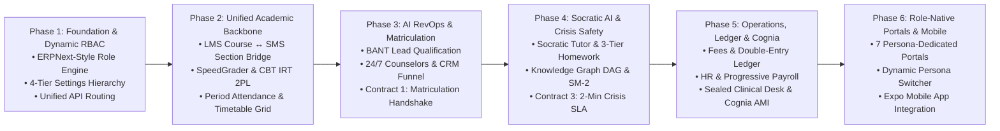

# 🚀 Master Implementation Roadmap: Autonomous Education Operating System (CSG-EMS)

This document establishes the authoritative, phased engineering roadmap to evolve `learnhouse-dev` into a unified, modular, AI-first Educational Management System (EMS).

---

## 🗺️ Architectural Phase Overview

---

## 📋 Granular Phase Deliverables & Validation Gates

### Phase 1: Foundation, Multi-Tenant Architecture & Dynamic ERPNext-Style RBAC
*Goal: Eliminate fragmented role checks with an enterprise, dynamic permission engine.*

- [ ] **1.1 Dynamic Role & Permission Data Schema**:
  - Create Alembic migration for `ems_role`, `ems_permission_rule`, and `ems_user_role_assignment`.
  - Seed the **7 Core System Role Templates** (`SUPER_ADMIN`, `SCHOOL_ADMIN`, `TEACHER`, `STUDENT`, `PARENT`, `PSYCHOLOGIST`, `STAFF`) + common extensions (`BURSAR`, `LIBRARIAN`, `TRANSPORT_MANAGER`).
- [ ] **1.2 High-Performance Permission Middleware & Dependencies**:
  - Implement `@require_permission(resource, action, scope)` in FastAPI with Redis caching.
  - Implement the **404-Never-403 rule** for confidential clinical resources (`clinical.case_notes`).
- [ ] **1.3 Unified API Router Standard**:
  - Restructure `apps/api/src/router.py` to route under standard `/api/v1/ems/...` namespaces.
- [ ] **1.4 4-Tier Settings Hierarchy (M20)**:
  - Implement configuration inheritance (`Global ➔ Organization ➔ Campus ➔ Department`).

---

### Phase 2: Academic Backbone Harmonization (LMS + SMS Curricular Bridge)
*Goal: Unify Learnhouse courses, class sections, live classrooms, and grading into a single flow.*

- [ ] **2.1 Course ↔ Class Section Bridge (`SectionSubject`)**:
  - Bind `Course` models to `SMS_Section`, `Academic_Year`, and assigned teachers.
- [ ] **2.2 SpeedGrader & Analytical Rubrics (M03)**:
  - Build the interactive side-by-side SpeedGrader studio with analytical rubric scoring and keyboard navigation.
- [ ] **2.3 Secure CBT Exams & IRT 2PL Psychometrics (M04)**:
  - Implement item banking, randomized pooling, and Item Response Theory ($\alpha$ discrimination & $\beta$ difficulty).
- [ ] **2.4 Unified Gradebook & Digital Report Cards (M05)**:
  - Implement spreadsheet-grade matrix with weighted GPAs, honors/AP rigor bonuses, and audit trails.
- [ ] **2.5 Period Attendance (M06) & Interactive Timetable Grid (M07)**:
  - Build quick-tap attendance strip with LiveKit dwell sync and drag-and-drop timetable grid with substitution solver.

---

### Phase 3: Pillar 2 (AI RevOps Engine) & The Matriculation Handshake
*Goal: Automate student recruitment, qualification, yield modeling, and onboarding.*

- [ ] **3.1 Multi-Channel Lead Intake (M21) & BANT Qualification (M22)**:
  - Implement lead deduplication and dynamic 5-factor BANT scoring.
- [ ] **3.2 24/7 Conversational Voice & Chat Counselors (M24) + Curriculum RAG (M34)**:
  - Implement admissions counseling agents grounded in verified campus syllabi and fee policies.
- [ ] **3.3 Multi-Stage Admissions CRM Pipeline (M28) & Deal Closing (M27)**:
  - Build interactive admissions Kanban board and Net Tuition Yield (NTY) modeling sliders.
- [ ] **3.4 Contract 1: The Automated Matriculation Handshake**:
  - Build atomic event listener that provisions permanent Student records, Parent links, Section enrollment, and Fee vouchers upon contract signing.

---

### Phase 4: Pillar 3 (AI Student Coach, Socratic Scaffolding & Crisis Safeguards)
*Goal: Deploy empathetic Socratic AI tutoring, cognitive memory engines, and psychiatric safety perimeters.*

- [ ] **4.1 Socratic 1-on-1 AI Tutor (M39) & 3-Tier Homework Assistant (M40)**:
  - Enforce Bloom's Taxonomy progression and progressive hint ladders (Clue ➔ Strategy ➔ Sub-Step).
- [ ] **4.2 Curriculum Knowledge Graph DAG (M44) & SM-2 Memory Engine (M43)**:
  - Implement subject prerequisite DAG validation and SuperMemo SM-2 spaced repetition review decks.
- [ ] **4.3 Contract 3: Universal 2-Minute Crisis Escalation SLA (M42, M47)**:
  - Implement local synchronous regex crisis classifier, instant conversational abort, emergency helpline cards, and quiet-hours-overriding alert to on-call school psychologists within $\le 120$s.
- [ ] **4.4 Contract 2: Academic Baseline Handshake**:
  - Sync daily gradebook scores and attendance patterns into SM-2 intervals and teacher oversight risk queues.

---

### Phase 5: Institutional Governance, Operations, Clinical Security & Cognia
*Goal: Complete financial ledgers, payroll, clinical encryption, and accreditation dossiers.*

- [ ] **5.1 Fees, Billing & Late Interest (M08)**:
  - Implement compounding daily late interest, sibling discounts, and bank reconciliation studio.
- [ ] **5.2 Double-Entry General Ledger (M09)**:
  - Enforce $\sum \text{Debits} \equiv \sum \text{Credits}$ balance invariants, chart of accounts, and reversing entries.
- [ ] **5.3 Staff HR & Burnout (M10) + Progressive Payroll (M11)**:
  - Implement algorithmic burnout risk detector and payroll engine with strict segregation of duties (preparer $\neq$ approver).
- [ ] **5.4 Client-Side Encrypted Psychological Clinical Desk (M14)**:
  - Implement AES-256-GCM client-side encryption for therapeutic case notes with fail-silent 404 protection.
- [ ] **5.5 Cognia Evidence Locker & Real-Time AMI Index (M16)**:
  - Implement automated dual-checksum SHA-256 evidence harvesting and real-time Accreditation Maturity Index calculation.

---

### Phase 6: Persona-Native Portals & Mobile Experience
*Goal: Replace generic admin sidebars with dedicated role portals and mobile clients.*

- [ ] **6.1 Role-Native Portals in Next.js (`apps/web`)**:
  - Build dedicated dashboard layouts for Executive, Teacher, Learner, Parent, Clinical, and Admissions personas.
- [ ] **6.2 Dynamic Persona Switcher**:
  - Add seamless header switcher for multi-role users (e.g., Admin who also teaches).
- [ ] **6.3 Expo React Native Mobile App (`apps/mobile`)**:
  - Polish mobile interfaces for Student revision sprints, Parent fee payments & bus telemetry, and Teacher quick-attendance.
