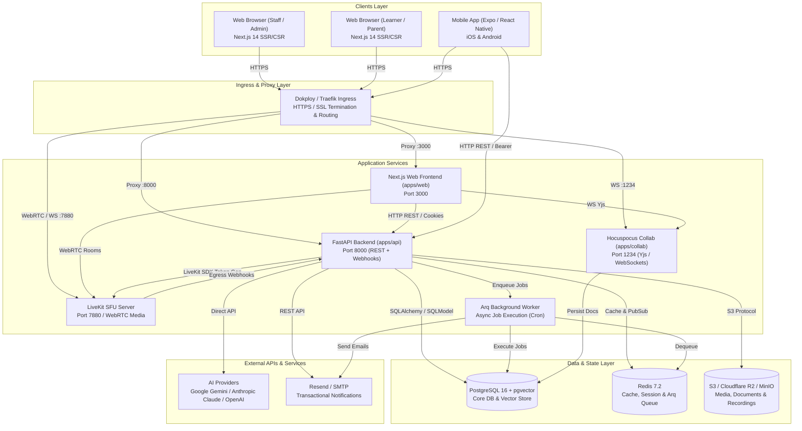
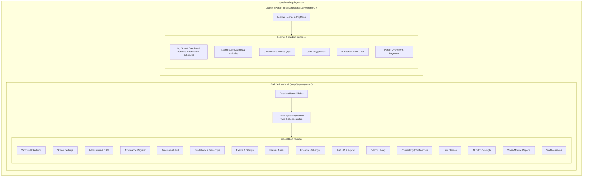
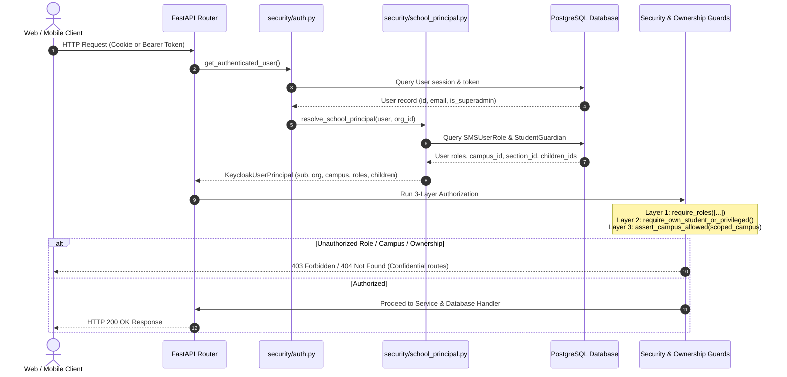

# 🏛️ System Architecture, Relational Models & Feature Catalog

This document provides a comprehensive structural, relational, and feature map of the entire LMS/SMS codebase (`learnhouse-dev`). It details the system architecture, dual frontend shells, security pipeline, complete database entity relationships, and module catalogs.

---

## 1. System Topology & Infrastructure Architecture



---

## 2. Dual Frontend Shell Architecture

The web application (`apps/web`) is structured around **two distinct layouts** (enforcing isolation between staff administration and learner activities):



---

## 3. Identity, Authentication & Security Pipeline

Authentication uses a unified session bridge where Learnhouse cookie/bearer tokens are resolved into structured school principals with 3-tier authorization guards.



---

## 4. Entity-Relationship Diagram (ERD)

The diagram below depicts the core database entities and relationships across all school and LMS modules.

```mermaid
erDiagram
    %% Core Tenancy & Identity
    ORGANIZATIONS ||--o{ SMS_CAMPUS : "owns"
    ORGANIZATIONS ||--o{ USERS : "contains"
    ORGANIZATIONS ||--o{ COURSES : "authors"
    
    SMS_CAMPUS ||--o{ ACADEMIC_YEAR : "schedules"
    ACADEMIC_YEAR ||--o{ SMS_TERM : "divides into"
    SMS_TERM ||--o{ SMS_SECTION : "hosts"
    SMS_CAMPUS ||--o{ SMS_SECTION : "contains"

    USERS ||--o{ SMS_USER_ROLE : "has roles"
    SMS_CAMPUS ||--o{ SMS_USER_ROLE : "scopes"
    USERS ||--o{ STUDENT_GUARDIAN : "parent"
    USERS ||--o{ STUDENT_GUARDIAN : "child"
    USERS ||--o{ SMS_STAFF_PROFILE : "staff record"

    %% Attendance & Pastoral
    SMS_SECTION ||--o{ SMS_ATTENDANCE_REGISTER : "daily/period register"
    SMS_ATTENDANCE_REGISTER ||--o{ SMS_ATTENDANCE_RECORD : "records"
    USERS ||--o{ SMS_ATTENDANCE_RECORD : "student status"
    SMS_ATTENDANCE_RECORD ||--o{ ATTENDANCE_CHANGE_EVENT : "audit history"
    USERS ||--o{ SMS_EXCUSE_NOTE : "submits"

    %% Timetable & Scheduling
    SMS_CAMPUS ||--o{ SMS_PERIOD : "defines period times"
    SMS_SECTION ||--o{ SMS_TIMETABLE_SLOT : "scheduled classes"
    USERS ||--o{ SMS_TIMETABLE_SLOT : "taught by teacher"
    SMS_TIMETABLE_SLOT ||--o{ SMS_SUBSTITUTION : "substitute teacher"
    SMS_TIMETABLE_SLOT ||--o{ SMS_LESSON_LOG : "class log"
    SMS_LESSON_LOG ||--o| SMS_LESSON_PLAN : "attaches AI plan"

    %% Gradebook & Exams
    SMS_CAMPUS ||--o{ SMS_GRADING_SCALE : "grading rules"
    SMS_SECTION ||--o{ SMS_ASSESSMENT_PLAN : "assessments"
    SMS_ASSESSMENT_PLAN ||--o{ SMS_GRADEBOOK_ENTRY : "student grades"
    USERS ||--o{ SMS_GRADEBOOK_ENTRY : "graded student"
    SMS_GRADEBOOK_ENTRY ||--o{ SMS_GRADE_CHANGE_EVENT : "audit log"
    SMS_SECTION ||--o{ SMS_REPORT_CARD : "generates cards"
    USERS ||--o{ SMS_REPORT_CARD : "student report"

    SMS_CAMPUS ||--o{ SMS_EXAM : "conducts"
    SMS_EXAM ||--o{ SMS_EXAM_SITTING : "sittings"
    SMS_EXAM_SITTING ||--o{ SMS_SEATING_ALLOCATION : "assigned seats"
    SMS_EXAM ||--o{ SMS_EXAM_RESIT : "resit attempts"

    %% Admissions & RevOps CRM
    ORGANIZATIONS ||--o{ REVOPS_LEAD : "captures enquiries"
    REVOPS_LEAD ||--o{ REVOPS_LEAD_ACTIVITY : "timeline"
    REVOPS_LEAD ||--o{ REVOPS_SEQUENCE : "nurture drip"
    ORGANIZATIONS ||--o{ SMS_ADMISSIONS_APPLICATION : "receives"
    SMS_ADMISSIONS_APPLICATION ||--o{ SMS_ADMISSIONS_DOCUMENT : "verifies docs"
    SMS_ADMISSIONS_APPLICATION ||--o{ SMS_ADMISSIONS_DECISION : "audit decision"

    %% Finance & Bursar
    SMS_CAMPUS ||--o{ SMS_FEE_STRUCTURE : "fee plans"
    USERS ||--o{ SMS_FEE_VOUCHER : "invoiced student"
    SMS_FEE_VOUCHER ||--o{ SMS_FEE_PAYMENT : "payments"
    SMS_FEE_VOUCHER ||--o{ SMS_FEE_CONCESSION : "discounts"
    SMS_FEE_PAYMENT ||--o{ SMS_FEE_REFUND : "refunds"
    ORGANIZATIONS ||--o{ SMS_BANK_TRANSACTION : "bank recon"

    %% HR & Payroll
    SMS_STAFF_PROFILE ||--o{ SMS_SALARY_STRUCTURE : "compensation"
    ORGANIZATIONS ||--o{ SMS_PAYROLL_RUN : "monthly payroll"
    SMS_PAYROLL_RUN ||--o{ SMS_PAYSLIP : "generates payslips"
    SMS_STAFF_PROFILE ||--o{ SMS_PAYSLIP : "receives slip"
    SMS_STAFF_PROFILE ||--o{ SMS_LEAVE_REQUEST : "leave records"
    SMS_STAFF_PROFILE ||--o{ SMS_STAFF_APPRAISAL : "performance reviews"

    %% Counselling & AI Safety
    USERS ||--o{ SMS_COUNSELING_SESSION : "student session"
    SMS_COUNSELING_SESSION ||--o{ SMS_CLINICAL_NOTE : "confidential notes"
    USERS ||--o{ SMS_CAREER_PLAN : "career guidance"
    USERS ||--o{ AI_SAFETY_INCIDENT : "flagged student"
    USERS ||--o{ AI_TUTOR_SESSION : "chat session"
    AI_TUTOR_SESSION ||--o{ AI_TUTOR_TRANSCRIPT : "dialogue turns"
    USERS ||--o{ AI_CONSENT : "parental consent"

    %% Library & Facilities
    SMS_CAMPUS ||--o{ SMS_LIBRARY_BOOK : "catalogues books"
    SMS_LIBRARY_BOOK ||--o{ SMS_LIBRARY_LOAN : "borrowings"
    USERS ||--o{ SMS_LIBRARY_LOAN : "borrower"
    SMS_LIBRARY_BOOK ||--o{ SMS_LIBRARY_RESERVATION : "holds queue"

    %% Live Classes & LMS
    SMS_SECTION ||--o{ SMS_LIVE_CLASS : "scheduled video class"
    COURSES ||--o{ COURSE_CHAPTERS : "chapters"
    COURSE_CHAPTERS ||--o{ COURSE_ACTIVITIES : "lessons & quizzes"
    ORGANIZATIONS ||--o{ BOARDS : "collab boards"
    ORGANIZATIONS ||--o{ PLAYGROUNDS : "code environments"
```



---

## 5. Comprehensive Feature & Module Matrix

| Module | UI Routes | API Prefix | Role Access | Feature Flag | Core DB Tables |
|---|---|---|---|---|---|
| **Campus & Tenancy** | `/dash/campus` | `/api/v1/sms` | `administer` | None (Always on) | `sms_campus`, `academic_year`, `sms_term`, `sms_section` |
| **School Settings** | `/dash/school-settings` | `/api/v1/sms/settings` | `administer` | None (Always on) | `sms_settings`, `organization_config` |
| **Admissions CRM** | `/dash/admissions`, `/leads`, `/applications`, `/offers` | `/api/v1/revops`, `/api/v1/sms/admissions` | `administer` | `revops` | `revops_lead`, `revops_activity`, `sms_admissions_application`, `sms_admissions_document` |
| **Attendance** | `/dash/attendance` (+ history, excuses, pastoral, bulk) | `/api/v1/sms/attendance` | `teach` (pastoral scoped) | `sms_attendance` | `sms_attendance_register`, `sms_attendance_record`, `attendance_change_event` |
| **Timetable** | `/dash/timetable` (+ generate, lessons, conflicts) | `/api/v1/sms/timetable` | `teach` (generate is `administer`) | `sms_timetable` | `sms_period`, `sms_timetable_slot`, `sms_substitution`, `sms_lesson_log` |
| **Gradebook** | `/dash/gradebook` (+ report-cards, student detail) | `/api/v1/sms/gradebook` | `teach` (scales `administer`) | `sms_gradebook` | `sms_grading_scale`, `sms_assessment_plan`, `sms_gradebook_entry`, `sms_report_card` |
| **Exams** | `/dash/exams` (+ seating, resits) | `/api/v1/sms/exams` | `teach` (resits `administer`) | `sms_exam` | `sms_exam`, `sms_exam_sitting`, `sms_seating_allocation`, `sms_exam_resit` |
| **Fees & Bursar** | `/dash/fees` (+ vouchers, bank recon, concessions) | `/api/v1/sms/fees` | `backOffice` (`_BURSAR`, `_BURSAR_LEAD`) | `sms_fees` | `sms_fee_structure`, `sms_fee_voucher`, `sms_fee_payment`, `sms_fee_concession`, `sms_bank_transaction` |
| **Financials** | `/dash/financials` (+ chart of accounts, journals) | `/api/v1/sms/financials` | `backOffice` (reversals `administer`) | `sms_financials` | `sms_chart_of_accounts`, `sms_journal_entry`, `sms_journal_line` |
| **HR & Payroll** | `/dash/hr`, `/dash/payroll` (+ offboarding, appraisals) | `/api/v1/sms/hr`, `/api/v1/sms/payroll` | `administer` (`_HR_ADMIN`, `_PAYROLL_ADMIN`) | `sms_hr_payroll` | `sms_staff_profile`, `sms_leave_request`, `sms_salary_structure`, `sms_payroll_run`, `sms_payslip` |
| **School Library** | `/dash/school-library` (+ reservations) | `/api/v1/sms/library` | `backOffice` (`_LIBRARIAN`) | `sms_library` | `sms_library_book`, `sms_library_loan`, `sms_library_reservation` |
| **Counselling** | `/dash/counseling` (+ career) | `/api/v1/sms/counseling` | `counsel` (PSYCHOLOGIST, 404-on-deny) | `tutor_counseling` | `sms_counseling_session`, `sms_clinical_note`, `sms_career_plan` |
| **Live Classes** | `/dash/live-classes`, `/dash/live-classes/[id]` | `/api/v1/live` | `teach` / Enrolled Students | None (Always on) | `sms_live_class`, `sms_live_class_attendance` |
| **AI Tutor Oversight** | `/dash/ai-tutor` | `/api/v1/ai/oversight` | Staff (Safety incidents `counsel` only) | `tutor_counseling` | `ai_safety_incident`, `ai_tutor_transcript`, `ai_consent` |
| **Reports** | `/dash/reports` | `/api/v1/sms/reports` | `administer` | `sms_reports` | Dynamic cross-module aggregation |
| **Messages** | `/dash/messages` | `/api/v1/sms/notifications` | All School Roles (Parent-Staff safeguarding) | None (Always on) | `notifications`, `notification_prefs`, `threads`, `messages` |
| **Learner LMS** | `/(withmenu)/courses`, `/boards`, `/playgrounds` | `/api/v1/courses`, `/api/v1/boards` | All learners & students | Core Learnhouse | `courses`, `chapters`, `activities`, `boards`, `playgrounds` |

---

## 6. Directory Structure & Organization Standard

```
learnhouse-dev/
├── apps/
│   ├── api/                   # Python 3.11 FastAPI backend
│   │   ├── src/
│   │   │   ├── core/          # App setup, database events, worker, redis
│   │   │   ├── db/            # SQLModel schema declarations (70+ models)
│   │   │   ├── middleware/    # Auth, tenancy, CORS, logging
│   │   │   ├── routers/       # FastAPI REST endpoints
│   │   │   ├── schemas/       # Pydantic request/response schemas
│   │   │   ├── security/      # Auth, school principals, ownership guards
│   │   │   └── services/      # Business logic (AI, SMS, RevOps, LiveKit)
│   │   └── alembic/           # Alembic database migrations
│   ├── web/                   # Next.js 14 Web Frontend
│   │   ├── app/               # Next.js App Router (Staff & Learner shells)
│   │   ├── components/        # React UI components & widgets
│   │   ├── hooks/             # Custom React hooks (useApiResource, etc.)
│   │   ├── lib/               # Utilities, navigation, permission configs
│   │   └── modules/           # Feature-specific SMS modules & subviews
│   ├── mobile/                # React Native / Expo Mobile App
│   ├── collab/                # Hocuspocus / Yjs Collaboration Service
│   ├── cli/                   # Developer & management CLI tools
│   └── e2e/                   # Playwright End-to-End test suite
├── PROJECT_DOCS/              # Verified system documentation & guides
│   ├── SYSTEM_DIAGRAMS_AND_FEATURES.md  # Master diagrams & feature catalog
│   ├── ARCHITECTURE.md        # Architecture principles & auth pipeline
│   ├── MODULES.md             # Detailed breakdown per module
│   ├── KNOWN_GAPS.md          # Open issues & unbuilt components
│   ├── DECISIONS.md           # Engineering & architectural decision records
│   ├── 360_AUDIT_REPORT.md    # Production readiness audit
│   ├── DEPLOYMENT.md          # Dokploy / Docker deployment guide
│   ├── BACKUP_RESTORE.md      # Database backup & restore procedures
│   ├── OBJECT_STORAGE.md      # S3 / R2 / MinIO storage configuration
│   ├── LOCAL_SETUP.md         # Local development runbook
│   └── archive/               # Historical logs & session archives
├── deploy/                    # Deployment configs (Keycloak, LiveKit, Nginx)
├── docker/                    # Dockerfiles & container assets
└── scripts/                   # Database seeding, backup, and restore scripts
```
