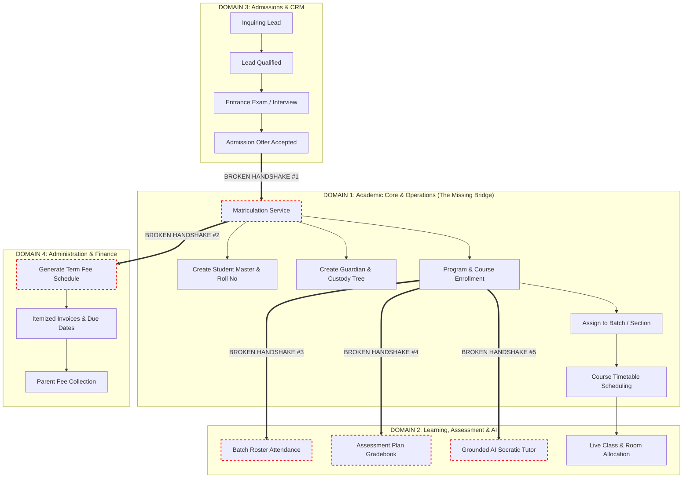

# Final Research Report: Architectural Deconstruction & Enterprise SMS Transformation
## Critical Evaluation of Modules, Pillars, Governance, Dependencies, and Business AI Integration

**Target Audience:** Executive Leadership, Educational Operators, and Product/Engineering Architects  
**Scope:** Research Audit of 50 Wiki Modules, 3 Pillars, System Dependencies, and Institutional Governance  
**Reference Documents:** `CSG-LMS.wiki/02-SOFTWARE-REQUIREMENTS-SPECIFICATIONS` (Pillars 1, 2, 3) & `06_PROPOSED_REQUIREMENTS_CHANGES.md`  

---

## 1. Executive Summary & Diagnostic Verdict

The CSG-LMS platform was initially architected around **50 granular specification modules** distributed across **3 arbitrary pillars** (Pillar 1: LMS-SMS, Pillar 2: AI-RevOps, Pillar 3: AI-Student-Coach) and governed by a rigid **7-Persona framework**.

### The Strategic Verdict
1. **The 50 "Modules" are conceptually flawed:** Over 40% of the listed "modules" fail the fundamental definition of a business module. They represent either **technical infrastructure plumbing** (WebSockets, LLM Model Routers, Redis checkpoints, RabbitMQ buses) or **micro-features** (e.g., separating "Marketing Agent" and "Copywriting Agent" into independent modules).
2. **The 3 Pillars create artificial silos:** Isolating AI into standalone "RevOps" and "Student Coach" pillars detaches AI capabilities from core school data. In a real-world educational institution, AI is not a department or pillar; it is an **intelligent capability layer embedded directly inside daily operational workflows**.
3. **The Core Academic Backbone is Missing:** Despite 50 modules, the system completely lacks the foundational relational entities needed to run a physical or hybrid school: **Academic Years/Terms, Programs, Courses, Syllabus Topics, Batches/Sections, Campuses, Classrooms, Student Master Records, Family/Guardian Custody Trees, and Enrollment Rosters**.
4. **7-Persona Governance is inadequate:** Hardcoding 7 fixed user roles into schemas and application logic cripples real school operations. Institutions require **Dynamic Role-Based Access Control (RBAC)** where administrators can define custom roles and granular permission keys.

---

## 2. Deconstruction of the 50 "Modules"

A true **Business Module** in enterprise software must fulfill three criteria:
- **Independent Business Domain:** It solves a cohesive, distinct business problem for specific stakeholders.
- **Encapsulated Master/Transactional Data:** It owns distinct business entities and lifecycle state machines.
- **Well-Defined External Interfaces:** It interacts with other domains via business events and contracts, not internal implementation mechanics.

### Audit of the 50 Current Modules

```
CURRENT 50 SPECIFICATIONS BREAKDOWN
┌─────────────────────────────────────────────────────────────────────────────────────────┐
│ [A] True Business Modules (18 Modules)                                                  │
│     M01 Admissions, M02 LiveClasses, M06 Attendance, M07 Timetable, M08 FeeManagement,  │
│     M09 FinancialMgmt, M10 HR, M11 Payroll, M12 DigitalLibrary, M13 Communication,      │
│     M14 PsychAssessment, M15 Transport, M16 CogniaEvidence, M21 LeadIntake,             │
│     M28 CRMPipeline, M41 CareerGuidance, M42 WellbeingCoach, M48 ParentPortal           │
├─────────────────────────────────────────────────────────────────────────────────────────┤
│ [B] Artificially Fragmented Twins (Should be Merged) (9 Modules -> 3 Domains)          │
│     • M03 Assignments + M04 Exam + M05 Gradebook  ==>  Academic Assessment & Evaluation │
│     • M22 Qualify + M25 Marketing + M26 Copywriting + M27 Closing ==> Admissions CRM    │
│     • M39 AITutor + M40 HomeworkAssistant + M43 Personalization ==> AI Adaptive Learning│
├─────────────────────────────────────────────────────────────────────────────────────────┤
│ [C] Technical Infrastructure / Plumbing (NOT Business Modules) (10 Modules)             │
│     • M29 ConversationMemory (Redis state)      • M38 ModelRouter (LiteLLM proxy)       │
│     • M32 IntegrationSync (RabbitMQ message bus)• M44 KnowledgeGraph (pgvector / RAG)   │
│     • M33 ConsentCompliance (GDPR audit trail)  • M47 ConsentSafety (LlamaGuard filter) │
│     • M30 AdminConfig (Platform settings)       • M49 WebSocketStreaming (SSE / WS)     │
│     • M17 PlatformAdmin (Tenant provisioning)   • M50 AI_LiveClass_QA (Sub-feature)     │
├─────────────────────────────────────────────────────────────────────────────────────────┤
│ [D] Completely Missing Core Modules (Zero Relational Foundation)                        │
│     • Academic Governance Masters (Academic Years, Terms, Calendars)                    │
│     • Curriculum Catalog (Programs, Courses, Credits, Syllabus Topics)                  │
│     • Campus & Facilities Master (Campuses, Buildings, Classrooms, Lab Capacities)     │
│     • Student & Family Network (Student Roll Numbers, Medical, Guardian Custody)        │
│     • Enrollment & Batch Engine (Cohort Sections, Program & Course Rosters)             │
└─────────────────────────────────────────────────────────────────────────────────────────┘
```

---

## 3. Structural Reorganization: The 4 Business Operational Domains

Instead of 3 arbitrary technical pillars, an enterprise school operates across **4 Core Business Domains**, supported by a shared **Platform Infrastructure & Embedded AI Layer**:

```
┌────────────────────────────────────────────────────────────────────────────────────────────────────────┐
│                                   ENTERPRISE SCHOOL MANAGEMENT SYSTEM                                  │
├────────────────────────────┬────────────────────────────┬──────────────────────────────────────────────┤
│ DOMAIN 1: ACADEMIC CORE    │ DOMAIN 2: CURRICULUM,      │ DOMAIN 3: ADMISSIONS, CRM    │
│ & SCHOOL OPERATIONS (SMS)  │ LEARNING & EVALUATION (LMS)│ & STUDENT RECRUITMENT        │
│ • Academic Years & Terms   │ • Course Content Delivery  │ • Omnichannel Lead Intake    │
│ • Programs, Courses, Topics│ • Virtual & Live Classes   │ • Lead Scoring & Tour Booking│
│ • Campuses & Classrooms    │ • Digital Library Reserves │ • Entrance Exams & Scoring   │
│ • Student & Guardian Tree  │ • Assignments & Homework   │ • Admission Offers & Signing │
│ • Batches & Class Sections │ • Online Exams & Bank      │ • Automated Matriculation    │
│ • Program/Course Enrolment │ • Assessment Plans & Wgts  │   Handshake into SMS Core    │
│ • Course Timetable Matrix  │ • Gradebook & Transcripts  │                              │
│ • Daily & Batch Attendance │ • AI Socratic Tutoring     │ DOMAIN 4: INSTITUTIONAL      │
│ • Student Incident Logs    │ • Personalized Study Paths │ ADMINISTRATION & FINANCE     │
│                            │ • Teacher Grading Rubrics  │ • Multi-Category Fees & Plans│
│                            │                            │ • Staff HR, Contracts & Pay  │
│                            │                            │ • Transport Fleet & Routes   │
│                            │                            │ • Accreditation (Cognia)     │
├────────────────────────────┴────────────────────────────┴──────────────────────────────────────────────┤
│ 🛠️ SHARED PLATFORM INFRASTRUCTURE & CROSS-CUTTING SERVICES:                                            │
│ • Dynamic RBAC & Identity (Keycloak/PostgreSQL)     • Multi-Tenant Row-Level Security (RLS)           │
│ • Enterprise Event Bus (RabbitMQ / Outbox Pattern)  • Central Audit Ledger & Compliance (GDPR/FERPA)  │
│ • Embedded AI Engine (LLM Model Router, Vector RAG pgvector, Guardrails, Streaming Service)           │
└────────────────────────────────────────────────────────────────────────────────────────────────────────┘
```

---

## 4. Deep System Dependency & Handshake Analysis

The primary failure of the current 50-module architecture is that **critical business handshakes are completely broken or missing**:



### The 5 Broken Handshakes Explained:

1. **Broken Handshake #1: The "Matriculation Cliff" (Admissions $\to$ Academic Core)**
   - *Current State:* `M01_Admissions` and `M27_DealClosing` end when an offer is signed. There is no automated process to create a permanent student master profile, issue a student ID/roll number, or place the student into a class.
   - *Fix:* Automated matriculation service creating `students`, `guardians`, and `program_enrollments` records upon offer acceptance and deposit verification.

2. **Broken Handshake #2: Automated Tuition Schedule Generation (Matriculation $\to$ Finance)**
   - *Current State:* `M08_FeeManagement` has no connection to enrolled programs or student categories.
   - *Fix:* Matriculation automatically calculates term fees, applies scholarships, generates itemized invoices (Tuition, Lab, Bus, Caution), and schedules payment due dates for parents.

3. **Broken Handshake #3: Roster-Backed Batch Attendance (Enrollment $\to$ Attendance)**
   - *Current State:* `M06_Attendance` logs individual student presence rows without validating whether the student is officially enrolled in that batch or course.
   - *Fix:* Attendance sessions are dynamically generated from active `course_enrollments` and `student_batches`.

4. **Broken Handshake #4: Curriculum-Aligned Assessment Plans (Enrollment $\to$ Gradebook)**
   - *Current State:* `M04_Exam` and `M05_Gradebook` store raw marks without course weighting plans (e.g., Homework 20%, Midterm 30%, Final 50%).
   - *Fix:* Every course has a defined `assessment_plan` with weighted criteria, automatically tabulating continuous evaluation into final GPA.

5. **Broken Handshake #5: Grounded AI Learning (Enrollment $\to$ AI Tutor)**
   - *Current State:* `M39_AITutor` and `M45_StudentProfile` use disconnected student IDs and generic vector searches.
   - *Fix:* The AI tutor is strictly grounded in the student's active course enrollments, current term syllabus topics, and upcoming homework assignments.

---

## 5. Governance Architecture: Dynamic RBAC vs 7-Persona System

### Why the "7-Persona System" is Unusable in Enterprise Schools
The legacy specification enforced a rigid enum: `SUPER_ADMIN, SCHOOL_ADMIN, TEACHER, STUDENT, PARENT, STAFF, PSYCHOLOGIST`. 
In real educational institutions, this model breaks down immediately:
- A **Department Head** is a teacher, but needs permission to approve lesson plans and review teacher performance.
- An **Admissions Officer** is administrative staff, but must not see financial payroll or psychological records.
- A **Bursar / Accountant** needs complete access to fees, invoices, and ledgers, but should not edit student grades.
- A **School Nurse** needs access to medical allergies and emergency contacts, but nothing else.
- A **Homeroom Teacher** needs to record attendance and disciplinary logs for their assigned batch, while a **Subject Teacher** only grades their specific subject.

### The Dynamic RBAC Model
We replace fixed personas with **Tenant-Configured Roles** and a **Hierarchical Permission Tree**:

```
DYNAMIC ROLE-BASED ACCESS CONTROL (RBAC)
┌────────────────────────────────────────────────────────────────────────────────────────┐
│ CONFIGURABLE SYSTEM ROLES                                                              │
│ • Super Admin (Platform Owner)        • Academic Dean / Principal                      │
│ • School Administrator                • Department Head / Curriculum Lead              │
│ • Admissions & Registrar Officer      • Homeroom / Class Teacher                       │
│ • Bursar / Finance Manager            • Subject Teacher / Instructor                   │
│ • School Nurse / Health Officer       • Student (Learner)                              │
│ • Psychologist / Counselor            • Parent / Primary Guardian / Sponsor            │
│ • Transport / Fleet Coordinator       • Substitute / Assistant Teacher                 │
├────────────────────────────────────────────────────────────────────────────────────────┤
│ GRANULAR PERMISSION TREE (domain : resource : action)                                  │
│                                                                                        │
│ [Academics]           [Attendance]            [Finance & Fees]        [Psychology]     │
│ • academics:batch:*   • attendance:batch:read • finance:invoice:create• psych:notes:read│
│ • academics:batch:wrt • attendance:batch:mark • finance:invoice:waive • psych:notes:wrt │
│ • academics:course:wrt• attendance:period:mark• finance:payment:record• psych:crisis:log│
│ • academics:term:close• attendance:audit:view • finance:report:view   (Strictly isolated│
│                                                                        from teachers)  │
│ [Grading & Exams]     [Admissions & CRM]      [Child Safety & Family]                  │
│ • grades:entry:submit • admissions:lead:write • family:custody:view                    │
│ • grades:rubric:manage• admissions:offer:issue• family:pickup:verify                   │
│ • grades:term:publish • admissions:enroll:do  • student:medical:read                   │
└────────────────────────────────────────────────────────────────────────────────────────┘
```

---

## 6. Business-Driven AI Integration Matrix (Genuine ROI)

AI must not be segregated into a standalone pillar. Below is the blueprint for embedding AI capabilities directly into operational workflows to achieve measurable institutional ROI:

| Operational Domain | Embedded AI Capability | Direct Business Problem Solved | Measurable Business ROI |
|---|---|---|---|
| **Admissions & Marketing** | Conversational Lead Qualification & Tour Booking Agent | Parents inquiring after hours or on weekends often abandon inquiries before staff respond. | **+35% Lead Conversion:** Instant 24/7 personalized inquiry response and automated calendar booking. |
| **Academic Timetabling** | Constraint & Conflict Solver Engine | Generating conflict-free timetables across 50 teachers, 30 classrooms, and 500 students takes weeks of manual trial-and-error. | **-90% Scheduling Time:** Solves room capacities, teacher gaps, and lab constraints in minutes. |
| **Student Retention & Attendance** | Predictive Dropout & Absenteeism Early Warning | Schools identify struggling or truant students too late, resulting in dropouts and lost tuition. | **+15% Retention Recovery:** Analyzes attendance drops and grade dips to alert counselors proactively. |
| **Teaching & Learning** | Curriculum-Grounded Socratic AI Tutor | Students get stuck on homework outside school hours; parents cannot always assist with advanced topics. | **Higher Academic Performance:** 24/7 Socratic guidance strictly aligned to the school's weekly syllabus topics. |
| **Assessment & Grading** | Automated Rubric Drafting & Formative Feedback | Teachers spend 15+ hours weekly grading essays, reports, and homework, leading to burnout. | **-60% Grading Turnaround:** Drafts rubric scores and qualitative feedback for teacher approval. |
| **Emergency Operations** | Smart Teacher Substitution Matcher | When a teacher calls in sick at 7:00 AM, finding an available qualified substitute is chaotic. | **Zero Class Downtime:** Instantly matches free qualified teachers, updates timetables, and notifies students. |

---

## 7. Concrete Next Steps & Action Plan

To execute this transition cleanly, the following roadmap is established:

1. **Step 1: Formalize Master Requirements in Wiki:**
   - Update `CSG-LMS.wiki` by organizing specifications into the **4 Business Operational Domains**.
   - Incorporate the academic masters from `06_PROPOSED_REQUIREMENTS_CHANGES.md` (Academic Years/Terms, Programs, Courses, Campuses, Classrooms, Batches, Students, Guardians, Enrollments).
2. **Step 2: Database Schema Implementation (`packages/database`):**
   - Create `packages/database/src/schema/academics.ts` defining the relational master data entities and multi-tenant RLS policies.
   - Update `admissions.ts`, `attendance.ts`, and `gradebook.ts` to reference the new relational master entities.
3. **Step 3: Core API Services (`apps/core`):**
   - Build the NestJS **Academics Core Module** exposing endpoints for term management, course catalog, batch assignments, and two-tier enrollments.
   - Build the automated **Matriculation Handshake Service** converting accepted applicants into enrolled students.
4. **Step 4: Dynamic RBAC Integration:**
   - Implement the hierarchical permission evaluation engine in `apps/core/src/auth` replacing hardcoded persona checks.
